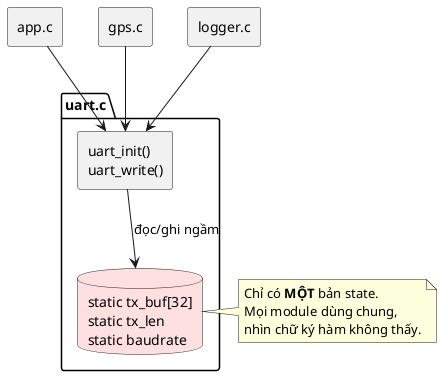
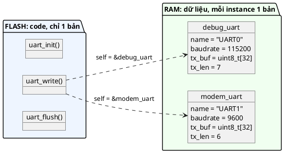
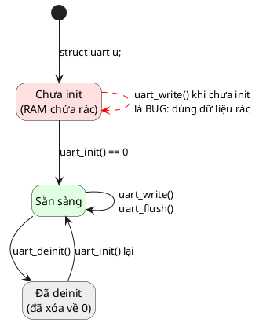
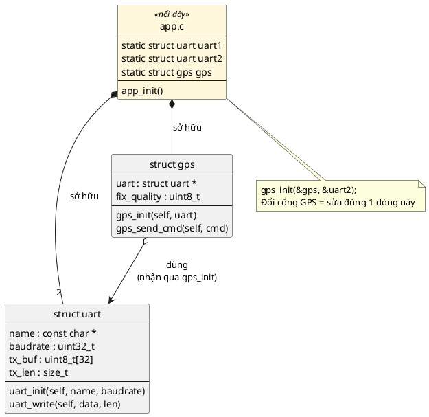
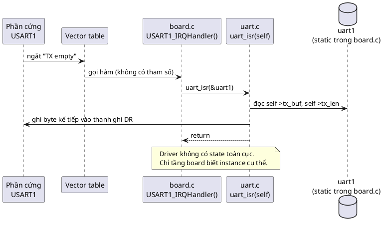

# Bài giảng 01 — Object Pattern

> **Về nguồn:** Chương *Introduction* của sách (Martin Schröder) chỉ nói Object Pattern là *"pattern quan trọng nhất trong C nhưng bị dùng quá ít"*. Theo sách, áp dụng nó vào một code base lộn xộn thì *"mọi thứ nhanh chóng vào đúng chỗ: gỡ rối dependency, buộc phải refactor hợp lý, làm code rõ ràng và đơn giản"*.
> Mọi phần giải thích chi tiết bên dưới là **kiến thức chung về embedded C**, không trích từ chương chi tiết của sách (thư mục `00_Document/` chưa có chương đó).

Code mẫu đi kèm: [inc/uart.h](inc/uart.h), [src/uart.c](src/uart.c), [main.c](main.c). Ghi chú ngắn: [README.md](README.md).

---

## Mục lục

1. [Bối cảnh: tại sao C cần pattern này](#1-bối-cảnh-tại-sao-c-cần-pattern-này)
2. [Vấn đề: code khi chưa có pattern](#2-vấn-đề-code-khi-chưa-có-pattern)
3. [Ý tưởng cốt lõi](#3-ý-tưởng-cốt-lõi)
4. [Các quy tắc và lý do của từng quy tắc](#4-các-quy-tắc-và-lý-do-của-từng-quy-tắc)
5. [Đọc code mẫu từng phần](#5-đọc-code-mẫu-từng-phần)
6. [Object chứa object: gỡ rối dependency](#6-object-chứa-object-gỡ-rối-dependency)
7. [Object Pattern trên phần cứng thật](#7-object-pattern-trên-phần-cứng-thật)
8. [Unit test với Object Pattern](#8-unit-test-với-object-pattern)
9. [Trade-off](#9-trade-off)
10. [Khi nào không cần dùng](#10-khi-nào-không-cần-dùng)
11. [Lỗi hay gặp](#11-lỗi-hay-gặp)
12. [Quy trình refactor code cũ sang Object Pattern](#12-quy-trình-refactor-code-cũ-sang-object-pattern)
13. [Tóm tắt và checklist](#13-tóm-tắt-và-checklist)
14. [Quiz (có đáp án)](#14-quiz-có-đáp-án)
15. [Bài tập](#15-bài-tập)

---

## 1. Bối cảnh: tại sao C cần pattern này

C không có `class`. Ngôn ngữ chỉ cho ta hai thứ rời nhau:

- **Dữ liệu:** biến và `struct`.
- **Hành vi:** hàm.

Không có gì bắt buộc dữ liệu nào đi với hàm nào. Cách viết "dễ nhất" khi mới làm firmware là khai báo biến `static` hoặc global ngay trong file `.c` rồi để các hàm dùng thẳng. Lúc dự án còn nhỏ, cách này chạy tốt. Khi dự án lớn dần, nó sinh ra đúng thứ sách gọi là **technical debt**: code ngày càng khó debug, khó tái sử dụng, khó test.

Object Pattern là một **quy ước** (C không ép, ta tự giữ) để gắn dữ liệu với hàm xử lý nó, giống class trong C++ nhưng làm bằng tay.

> Pattern là một quy tắc cả team cùng tuân theo. Khi ai cũng viết `module_action(struct module *self, ...)`, người đọc code biết ngay hàm đó thao tác lên dữ liệu nào, không phải đi đoán. Sách gọi đây là **"clear expectations"**.

---

## 2. Vấn đề: code khi chưa có pattern

Driver UART viết kiểu "bình thường":

```c
/* uart.c */
#include "uart.h"

static uint8_t tx_buf[32];
static size_t tx_len;
static uint32_t baudrate;

void uart_init(uint32_t baud)
{
	baudrate = baud;
	tx_len = 0;
	/* cấu hình thanh ghi của USART1 ... */
}

int uart_write(const uint8_t *data, size_t len)
{
	if (tx_len + len > sizeof(tx_buf)) {
		return -1;
	}
	memcpy(&tx_buf[tx_len], data, len);
	tx_len += len;
	return 0;
}
```

```c
/* app.c */
uart_init(115200);
uart_write((const uint8_t *)"hello", 5);
```

Code gọn, dễ đọc, chạy được. Nhưng nó có 6 vấn đề:

### Vấn đề 1: Chỉ dùng được một instance

Board thật thường có nhiều UART: một cho debug log, một nối modem, một nối GPS. Với code trên chỉ có đúng một bộ `tx_buf`/`tx_len`. Muốn có UART thứ hai thì phải:

- copy thành `uart2.c` với `uart2_write()`, sửa lỗi ở một bản thì quên bản kia; hoặc
- thêm tham số `int port` rồi dùng `static uint8_t tx_buf[3][32]`, và code đầy `if (port == ...)`.

Cả hai cách đều tệ, và càng nhiều instance càng tệ hơn.

### Vấn đề 2: State bị giấu, dependency ẩn

Nhìn chữ ký `int uart_write(const uint8_t *data, size_t len)`, bạn **không biết** hàm này đọc/ghi những biến nào. Muốn biết thì phải mở `uart.c` ra đọc hết.

Khi debug, bạn thấy `tx_len` có giá trị lạ. Ai đã sửa nó? Mọi hàm trong `uart.c` đều có thể sửa, và nếu nó là global (không `static`) thì mọi file trong project cũng sửa được.

### Vấn đề 3: Vòng đời không rõ ràng

Biến `static` tồn tại từ lúc chip khởi động tới lúc mất điện. Không có khái niệm "tạo" hay "hủy" UART. Nếu ai đó gọi `uart_write()` trước `uart_init()` thì sao? Code vẫn chạy, `baudrate = 0`, và bug xuất hiện ở chỗ không ai ngờ.

### Vấn đề 4: Khó unit test

```c
void test_write_ok(void)       { uart_write(data, 20); /* tx_len = 20 */ }
void test_write_overflow(void) { uart_write(data, 20); /* tx_len = 40 → lỗi?! */ }
```

Test thứ hai **phụ thuộc vào test thứ nhất** vì hai test dùng chung biến `static`. Đổi thứ tự chạy là kết quả đổi theo. Muốn reset thì phải thêm hàm `uart_reset_for_test()`: code thật bị làm bẩn chỉ để phục vụ test.

### Vấn đề 5: Khó dùng khi có concurrency

Nếu hai thread (hoặc thread và ISR) cùng gọi `uart_write()`, chúng tranh nhau **cùng một** `tx_len`. Object Pattern không tự giải quyết race condition (bài 11–13 sẽ lo), nhưng nó giúp **khoanh vùng**: dữ liệu cần bảo vệ nằm gọn trong một struct, nên sau này đặt spinlock/mutex vào chính struct đó là xong.

### Vấn đề 6: Module khác bị gắn chặt vào UART cụ thể

```c
/* gps.c */
void gps_send_cmd(const char *cmd)
{
	uart_write((const uint8_t *)cmd, strlen(cmd));   /* UART nào? Cái duy nhất. */
}
```

`gps.c` bị **cứng** vào "UART duy nhất đó". Đổi GPS sang cổng UART khác thì phải sửa `gps.c`. Đây chính là thứ sách gọi là dependency rối.

### Toàn cảnh: 6 vấn đề trên trong một hình



---

## 3. Ý tưởng cốt lõi

> **Gom toàn bộ state của module vào một `struct`. Mọi hàm của module nhận con trỏ tới struct đó làm tham số đầu tiên.**

```c
struct uart {
	const char *name;
	uint32_t baudrate;
	uint8_t tx_buf[32];
	size_t tx_len;
};

int uart_init(struct uart *self, const char *name, uint32_t baudrate);
int uart_write(struct uart *self, const uint8_t *data, size_t len);
```

Mỗi biến kiểu `struct uart` là một **object** (instance). Mỗi hàm `uart_xxx(self, ...)` đóng vai **method**.

### So sánh với C++

```cpp
// C++
class Uart {
public:
	int write(const uint8_t *data, size_t len);
private:
	uint8_t tx_buf[32];
	size_t tx_len;
};

debug_uart.write(data, len);
```

Khi compile, C++ âm thầm biến `debug_uart.write(data, len)` thành một lời gọi hàm có thêm tham số ẩn `this = &debug_uart`. Object Pattern trong C chỉ là **viết tường minh** điều đó:

```c
uart_write(&debug_uart, data, len);   /* self chính là this */
```

Nên Object Pattern **không phải trò hack**. Đó chính là cách OOP hoạt động ở tầng máy.

### Bộ nhớ trông như thế nào



- **Code** (Flash) chỉ có một bản, dù có bao nhiêu UART.
- **Dữ liệu** (RAM) có một bản cho mỗi instance.
- `self` cho hàm biết lần gọi này đang làm việc với instance nào.

---

## 4. Các quy tắc và lý do của từng quy tắc

### Quy tắc 1: Toàn bộ state nằm trong struct, không có biến `static` trong `.c`

**Tại sao:** Chỉ cần sót **một** biến `static` là mọi instance ngầm dùng chung biến đó, và bạn mất đúng lợi ích chính của pattern. Ví dụ `static int error_count;` sẽ đếm lỗi của **tất cả** UART cộng lại, không phải từng UART.

**Ngoại lệ hợp lệ:** bảng hằng số chỉ đọc, ví dụ `static const uint16_t crc_table[256] = {...};`. Nó không phải *state* (không bao giờ thay đổi), và nằm trong Flash chứ không tốn RAM.

### Quy tắc 2: Đặt tên có tiền tố module: `uart_init`, `uart_write`, `struct uart`, `UART_TX_BUF_SIZE`

**Tại sao:**
- C **không có namespace**. Mọi hàm không `static` nằm chung một không gian tên khi link. Nếu `uart.c` và `spi.c` cùng có hàm `init()` thì linker báo lỗi *multiple definition*. Tiền tố giải quyết chuyện đó.
- Nhìn tên là biết hàm thuộc module nào, gõ `uart_` là IDE gợi ý đủ các "method".

### Quy tắc 3: `self` luôn là tham số **đầu tiên**

**Tại sao:**
- **Nhất quán:** đọc `uart_write(&u, ...)` giống như đọc `u.write(...)`.
- **Rẻ:** trên ARM Cortex-M (quy ước gọi hàm AAPCS), 4 tham số đầu được truyền qua thanh ghi `r0`–`r3`. `self` nằm ở `r0`, không tốn stack.
- **Chuẩn bị cho các bài sau:** Virtual API (bài 07) và Callback (bài 05) đều dựa vào quy ước "tham số đầu là object".

### Quy tắc 4: Có `init` và `deinit` rõ ràng

```c
int uart_init(struct uart *self, const char *name, uint32_t baudrate);
int uart_deinit(struct uart *self);
```

**Tại sao:**
- **Vòng đời rõ ràng:** object chỉ hợp lệ trong khoảng giữa `init` và `deinit`. Đọc code là thấy.
- **`init` phải `memset` cả struct về 0:** object khai báo trên stack (`struct uart u;`) chứa **rác**, tức giá trị còn sót lại trong RAM từ lần dùng trước. Không xóa thì `tx_len` có thể là 3000.
- **`deinit` cũng `memset` về 0:** nếu ai đó lỡ dùng object sau khi deinit, `name` là `NULL` nên lỗi lộ ra ngay thay vì chạy âm thầm với dữ liệu cũ.

Vòng đời của một object:



**Tại sao không viết `struct uart uart_create(...)` trả về struct?** C cho phép trả struct theo giá trị, nhưng:
- Cả struct bị **copy** (ở đây là 32+ byte, và driver thật có thể lớn hơn nhiều).
- Nếu trong `init` bạn đăng ký địa chỉ object với chỗ khác (ví dụ ISR giữ con trỏ tới nó), thì sau khi trả về, địa chỉ đó trỏ vào **bản cũ đã bị hủy**. Truyền `self` vào `init` thì object nằm cố định ngay từ đầu.

### Quy tắc 5: Caller cấp phát bộ nhớ cho object

Driver **không** tự tạo object. Caller quyết định object nằm ở đâu:

```c
/* (a) Biến static: sống suốt chương trình, phổ biến nhất trong firmware */
static struct uart debug_uart;

/* (b) Trên stack: sống trong phạm vi hàm, tiện cho test */
void test(void) { struct uart u; uart_init(&u, "T", 9600); ... }

/* (c) Nằm trong object khác (composition) */
struct modem {
	struct uart uart;       /* modem sở hữu luôn UART của nó */
	uint8_t state;
};
```

**Tại sao không `malloc`?**
- Heap trong embedded bị **phân mảnh** (fragmentation): chạy vài tuần thì `malloc` thất bại dù tổng RAM còn trống.
- `malloc` có thời gian chạy không cố định, không hợp với hệ real-time.
- Nhiều chuẩn an toàn (MISRA C, ...) cấm hoặc hạn chế cấp phát động.
- Cấp phát tĩnh thì **linker cho biết chính xác tổng RAM dùng lúc build**. Thiếu RAM là biết ngay lúc build, không phải lúc sản phẩm đã ra thị trường.

> Bài 02 (Opaque) sẽ quay lại câu hỏi cấp phát, vì khi giấu struct thì caller không còn biết `sizeof` để tự cấp phát nữa.

### Quy tắc 6: Hàm trả về mã lỗi `int`, dữ liệu trả qua con trỏ

```c
int tmp102_read_temp(struct tmp102 *self, int16_t *out_centi_deg);
```

**Tại sao:** giá trị trả về luôn dành cho **trạng thái** (0 = OK, âm = lỗi), còn dữ liệu thật đi qua tham số con trỏ. Nếu trả thẳng `int16_t` thì làm sao phân biệt "nhiệt độ −1 độ" với "lỗi −1"? Đây là tiền đề của bài 09 (Return Value).

### Quy tắc 7: Kiểm tra `self` và đầu vào

```c
if (!self || !data) {
	return -EINVAL;
}
```

Có hai trường phái:
- **Trả `-EINVAL`** (code mẫu dùng cách này): an toàn, caller có thể xử lý.
- **`assert(self)`**: truyền `NULL` vào là **lỗi lập trình**, không phải lỗi runtime, nên cho chương trình dừng ngay khi debug.

Nhiều code base kết hợp: `assert` cho `self` (lỗi của lập trình viên), và `-EINVAL` cho dữ liệu đến từ bên ngoài. Điều quan trọng nhất là **thống nhất một cách trong cả project**.

### Quy tắc 8: Dùng `const` cho hàm chỉ đọc

```c
size_t uart_tx_pending(const struct uart *self);   /* hứa không sửa object */
```

**Tại sao:** `const` là tài liệu mà compiler kiểm tra giúp. Người đọc biết hàm này an toàn, không đổi state. Nếu vô tình viết `self->tx_len = 0;` bên trong, compiler báo lỗi ngay.

### Quy tắc 9: Bên ngoài module không đụng vào field của struct

```c
debug_uart.tx_len = 0;   /* ❌ C cho phép, nhưng phá vỡ pattern */
uart_flush(&debug_uart); /* ✅ đi qua API */
```

**Tại sao:** nếu ai cũng sửa field trực tiếp thì module mất quyền kiểm soát tính đúng đắn của dữ liệu. Ở Object Pattern, đây **chỉ là quy ước**, compiler không chặn. Đó là điểm yếu lớn nhất của pattern này, và là lý do có bài 02 (Opaque): Opaque khiến compiler **thật sự cấm** việc này.

---

## 5. Đọc code mẫu từng phần

### Header: [inc/uart.h](inc/uart.h)

```c
#ifndef UART_H
#define UART_H
```
Include guard: tránh lỗi định nghĩa trùng khi header bị include nhiều lần.

```c
#define UART_TX_BUF_SIZE 32
```
Hằng số có tiền tố module. Nó nằm trong header vì caller cần biết kích thước struct để tự cấp phát (quy tắc 5).

```c
struct uart {
	const char *name;       /* Trên phần cứng thật: địa chỉ base của thanh ghi */
	uint32_t baudrate;
	uint8_t tx_buf[UART_TX_BUF_SIZE];
	size_t tx_len;
};
```
- `name` trên PC chỉ dùng để in ra. Trên chip thật, vị trí này là **con trỏ tới khối thanh ghi** của peripheral (xem mục 7). Đó là thứ phân biệt UART0 với UART1.
- `tx_buf` là mảng **nằm trong** struct, không phải con trỏ, nên mỗi instance có buffer riêng và không cần `malloc`.
- Dùng `uint32_t`, `uint8_t` từ `<stdint.h>` vì kích thước `int` khác nhau giữa các chip (16 bit trên MSP430, 32 bit trên ARM).

### `uart_init`: [src/uart.c](src/uart.c)

```c
int uart_init(struct uart *self, const char *name, uint32_t baudrate)
{
	if (!self || !name || baudrate == 0) {
		return -EINVAL;
	}
	memset(self, 0, sizeof(*self));
	self->name = name;
	self->baudrate = baudrate;
	return 0;
}
```
- Kiểm tra đầu vào **trước** khi đụng vào object.
- `sizeof(*self)` thay vì `sizeof(struct uart)`: nếu sau này đổi kiểu của `self` thì dòng này vẫn đúng.
- `memset` xong mới gán field: mọi field không được gán rõ ràng (`tx_len`, `tx_buf`) đều là 0.

### `uart_write`: chú ý phép kiểm tra tràn

```c
if (len > UART_TX_BUF_SIZE - self->tx_len) {
	return -ENOSPC;
}
```

Sao không viết `if (self->tx_len + len > UART_TX_BUF_SIZE)` cho dễ đọc? Vì **integer overflow**: nếu caller truyền `len` rất lớn (ví dụ `SIZE_MAX`), phép cộng `tx_len + len` bị tràn và quay vòng thành một số nhỏ, phép kiểm tra **đậu**, rồi `memcpy` ghi đè cả RAM. Viết bằng phép trừ thì an toàn, vì `tx_len` luôn ≤ `UART_TX_BUF_SIZE` nên `UART_TX_BUF_SIZE - tx_len` không bao giờ âm.

Đây là bug thật, rất hay gặp trong firmware. Code "trước khi có pattern" ở mục 2 mắc đúng lỗi này.

```c
/* Từ chối cả gói thay vì ghi một nửa */
```
Đây là một **quyết định thiết kế**: hoặc ghi hết, hoặc không ghi gì. Nhờ vậy caller không phải xử lý trường hợp "ghi được 20/40 byte". Cách khác (ghi một phần rồi trả về số byte đã ghi) cũng hợp lệ, nhưng phải ghi rõ trong API.

### `main.c`: [main.c](main.c)

```c
struct uart debug_uart;
struct uart modem_uart;

uart_init(&debug_uart, "UART0", 115200);
uart_init(&modem_uart, "UART1", 9600);
```
Hai instance, một bộ code. Ghi vào `debug_uart` không ảnh hưởng `modem_uart`. Kết quả chạy:

```
[UART0 @ 115200] boot ok
[UART1 @ 9600] AT+CSQ
write oversized message -> -28
```
`-28` là `-ENOSPC`: gói 42 byte bị từ chối vì buffer chỉ có 32 byte.

---

## 6. Object chứa object: gỡ rối dependency

Đây là phần sách nhấn mạnh: Object Pattern **"irons out dependencies"** (làm phẳng dependency). Cơ chế cụ thể như sau.

Quay lại vấn đề 6: `gps.c` gọi thẳng `uart_write()` nên bị cứng vào một UART. Với Object Pattern, GPS **nhận** UART từ bên ngoài:

```c
/* gps.h */
struct uart;   /* chỉ cần khai báo trước, không cần include cả uart.h */

struct gps {
	struct uart *uart;   /* GPS dùng UART nào thì do người tạo GPS quyết định */
	uint8_t fix_quality;
};

int gps_init(struct gps *self, struct uart *uart);
int gps_send_cmd(struct gps *self, const char *cmd);
```

```c
/* gps.c */
int gps_send_cmd(struct gps *self, const char *cmd)
{
	return uart_write(self->uart, (const uint8_t *)cmd, strlen(cmd));
}
```

```c
/* app.c: nơi duy nhất "nối dây" các object với nhau */
static struct uart uart1;
static struct uart uart2;
static struct gps gps;

void app_init(void)
{
	uart_init(&uart1, "UART1", 115200);
	uart_init(&uart2, "UART2", 9600);
	gps_init(&gps, &uart2);   /* đổi cổng GPS = đổi đúng 1 dòng này */
}
```

Kỹ thuật này gọi là **dependency injection**: object không tự đi tìm thứ nó cần mà được **đưa vào** qua `init`.

Lợi ích:
- `gps.c` không biết và không quan tâm GPS nối vào cổng nào.
- Hai con GPS trên hai UART? Tạo hai `struct gps`, mỗi con nhận một UART.
- Mọi việc "nối dây" dồn về một chỗ (`app.c` hoặc `board.c`). Muốn hiểu hệ thống ráp với nhau thế nào, chỉ cần đọc một file.



Cách đọc: `*--` (hình thoi đặc) là **sở hữu**: `app.c` cấp phát và quản lý vòng đời object. `o-->` (hình thoi rỗng) là **dùng**: GPS chỉ giữ con trỏ tới UART, không sở hữu nó.

Với cách này, `gps.c` vẫn phụ thuộc vào **đúng loại** `struct uart`. Nếu muốn GPS chạy được trên cả UART lẫn USB-CDC mà không sửa `gps.c`, ta cần **Virtual API** (bài 07). Object Pattern là bước đầu tiên của con đường đó.

---

## 7. Object Pattern trên phần cứng thật

### Object giữ con trỏ tới thanh ghi

Trên vi điều khiển, thứ phân biệt UART0 với UART1 là **địa chỉ khối thanh ghi**. Driver thật trông gần như sau:

```c
struct uart {
	volatile struct uart_regs *regs;   /* ví dụ 0x40011000 cho USART1 */
	uint8_t tx_buf[64];
	size_t tx_len;
};

int uart_init(struct uart *self, volatile struct uart_regs *regs, uint32_t baudrate)
{
	memset(self, 0, sizeof(*self));
	self->regs = regs;
	self->regs->BRR = SYSTEM_CLOCK / baudrate;   /* cấu hình đúng khối thanh ghi */
	return 0;
}
```

Một bộ code, nhưng mỗi instance ghi vào khối thanh ghi riêng.

### Bạn đã dùng pattern này mà có thể chưa để ý

- **STM32 HAL:** `UART_HandleTypeDef huart2;` là object, và `HAL_UART_Transmit(&huart2, data, len, timeout);` là method. `huart2.Instance` chính là con trỏ tới thanh ghi USART2. Đúng Object Pattern.
- **Zephyr RTOS:** `uart_poll_out(dev, c);`, trong đó `dev` là `const struct device *`, object đại diện cho một peripheral.

### Interrupt: ISR tìm object bằng cách nào?

ISR **không có tham số**: tên hàm và chữ ký do vector table cố định. Vậy làm sao ISR biết `self`?

```c
/* board.c: nơi DUY NHẤT biết board có những peripheral nào */
static struct uart uart1;

void USART1_IRQHandler(void)
{
	uart_isr(&uart1);   /* chuyển tiếp vào method của đúng object */
}
```

Luồng gọi khi có ngắt:



- Biến `static` **vẫn tồn tại**, nhưng nằm ở tầng **board/application**, không nằm trong driver.
- Driver `uart.c` vẫn sạch, tái sử dụng được, không biết có bao nhiêu UART.
- Nguyên tắc: **driver không có state toàn cục; board thì được có**, vì board mô tả phần cứng cụ thể, vốn là thứ duy nhất.

---

## 8. Unit test với Object Pattern

Vì mỗi test tự tạo object mới nên các test **độc lập hoàn toàn** với nhau:

```c
#include <assert.h>
#include <errno.h>
#include "uart.h"

static void test_write_ok(void)
{
	struct uart u;
	assert(uart_init(&u, "T", 9600) == 0);
	assert(uart_write(&u, (const uint8_t *)"abc", 3) == 0);
	assert(u.tx_len == 3);   /* test được phép nhìn vào field */
}

static void test_write_rejects_overflow(void)
{
	struct uart u;   /* object mới tinh, không dính gì tới test trước */
	uint8_t big[UART_TX_BUF_SIZE + 1] = {0};
	assert(uart_init(&u, "T", 9600) == 0);
	assert(uart_write(&u, big, sizeof(big)) == -ENOSPC);
	assert(u.tx_len == 0);   /* không bị ghi một nửa */
}

int main(void)
{
	test_write_ok();
	test_write_rejects_overflow();
	return 0;
}
```

So với code dùng `static` ở mục 2, bạn không cần hàm reset, không lo thứ tự chạy test, và có thể chạy test trên PC mà không cần board.

---

## 9. Trade-off

| Tiêu chí | Ảnh hưởng | Giải thích |
|---|---|---|
| **RAM** | Như cũ | Dữ liệu vẫn vậy, chỉ gom vào struct. Có thể thêm vài byte padding do căn lề (alignment). |
| **Flash** | Như cũ hoặc giảm | Nhiều instance dùng chung một bộ code, thay vì copy `uart0.c`, `uart1.c`. |
| **Tốc độ** | Chậm hơn không đáng kể | Thêm 1 tham số (qua thanh ghi) và truy cập qua con trỏ (`self->x`, thêm offset). Hầu như không đo được. |
| **Độ phức tạp** | Thêm một chút | Phải gõ `self->` và gọi `init`. Đổi lại cấu trúc rõ ràng hơn nhiều. |
| **Testability** | Tốt hơn hẳn | Mỗi test một object mới. |
| **Đóng gói** | Yếu | Field vẫn public, chỉ được bảo vệ bằng quy ước. Opaque (bài 02) vá chỗ này. |
| **Thread safety** | Không tự có | Pattern chỉ gom dữ liệu vào một chỗ, việc khóa phải tự làm (bài 11–13). |

---

## 10. Khi nào không cần dùng

- **Hàm thuần túy, không có state:** `crc16(const uint8_t *data, size_t len)`, `clamp(x, lo, hi)`. Không có gì để gom vào struct.
- **Script một lần, prototype vứt đi:** sách khuyên cứ viết cho chạy trước rồi refactor. Nhưng code nào sẽ đi vào sản phẩm thì phải refactor trước khi coi là xong.
- **Chip cực nhỏ (vài trăm byte RAM, 8-bit):** truy cập qua con trỏ trên một số kiến trúc 8-bit tốn hơn đáng kể so với ARM. Ngay cả khi đó vẫn nên giữ **cách đặt tên và cấu trúc** của pattern cho dễ đọc.

> Sách nhấn mạnh pattern có giá trị khi **áp dụng ở mọi nơi**. Một project mà nửa module dùng Object Pattern, nửa kia dùng biến `static` thì người đọc lại mất "clear expectations".

---

## 11. Lỗi hay gặp

| Lỗi | Hậu quả | Cách tránh |
|---|---|---|
| Quên gọi `init` | Object trên stack chứa rác, bug ngẫu nhiên | Luôn `init` ngay sau khi khai báo; kiểm tra kết quả trả về |
| Sót một biến `static` trong `.c` | Các instance ngầm dùng chung state | `grep -n "static" src/*.c`: chỉ được còn hàm `static` và bảng `static const` |
| Copy struct bằng `=` | Hai object cùng trỏ vào một tài nguyên (thanh ghi, buffer ngoài); ISR vẫn giữ địa chỉ bản cũ | Truyền con trỏ, không copy object |
| Object trên stack của hàm đã return | Con trỏ treo (dangling pointer), đặc biệt nguy hiểm nếu ISR hoặc object khác giữ địa chỉ đó | Object sống lâu thì khai báo `static` ở tầng app/board |
| Dùng object sau `deinit` | Dữ liệu cũ hoặc crash | `deinit` xóa về 0 để lỗi lộ ra sớm |
| Sửa field từ bên ngoài | Phá tính đúng đắn của module | Chỉ đi qua API; tiến tới Opaque (bài 02) |
| Kiểm tra tràn bằng phép cộng | Integer overflow, ghi đè bộ nhớ | Viết bằng phép trừ (xem mục 5) |
| Nghĩ rằng có object là thread-safe | Race condition | Thêm lock vào struct (bài 11–13) |

---

## 12. Quy trình refactor code cũ sang Object Pattern

Sách khuyên cách học tốt nhất là **refactor code có sẵn**. Các bước:

1. **Liệt kê** mọi biến `static`/global mà module dùng.
2. **Tạo struct** `struct <module>` chứa đúng các biến đó.
3. **Thêm `self`** làm tham số đầu tiên của mọi hàm public, rồi đổi `tx_len` thành `self->tx_len` bên trong.
4. **Tạo `init`/`deinit`**: chuyển giá trị khởi tạo của biến `static` vào `init`.
5. **Chuyển instance ra ngoài**: khai báo `static struct uart uart1;` ở tầng app/board.
6. **Build và sửa lỗi compile**: compiler sẽ chỉ ra mọi chỗ gọi hàm còn thiếu `self`. Đây chính là thứ sách gọi là *"forces sensible refactoring"*: pattern ép bạn nhìn thấy mọi dependency.
7. **Kiểm tra lại**: `grep static` trong file `.c`, đảm bảo không còn state toàn cục.
8. **Viết test** cho vài trường hợp, mỗi test một object mới.

---

## 13. Tóm tắt và checklist

**Một câu:** *Dữ liệu vào struct, hàm nhận `self`, caller sở hữu bộ nhớ.*

Checklist cho mỗi module bạn viết:

- [ ] Có `struct <module>` chứa **toàn bộ** state
- [ ] Không còn biến `static` có thể thay đổi trong `.c` (bảng `static const` thì được)
- [ ] Mọi hàm public có dạng `<module>_<action>(struct <module> *self, ...)`
- [ ] Có `<module>_init()` và `<module>_deinit()`; `init` xóa sạch struct
- [ ] Hàm trả về `int` (0 = OK, âm = lỗi); dữ liệu trả qua con trỏ
- [ ] Hàm chỉ đọc dùng `const struct <module> *self`
- [ ] Không `malloc`: caller cấp phát (static / stack / nằm trong struct khác)
- [ ] Object phụ thuộc object khác thì nhận qua `init` (dependency injection)
- [ ] Bên ngoài module không truy cập field trực tiếp

---

## 14. Quiz (có đáp án)

Tự trả lời trước rồi mới mở đáp án.

**Câu 1.** Tại sao Object Pattern giúp unit test dễ hơn so với biến `static` trong file `.c`?

<details><summary>Đáp án</summary>

Mỗi test tạo một object mới, có state sạch sau `init`, nên các test độc lập, chạy theo thứ tự nào cũng cho cùng kết quả. Với biến `static`, state từ test trước còn sót lại, và muốn reset phải thêm code chỉ để phục vụ test.
</details>

**Câu 2.** Trong `uart_write(struct uart *self, ...)`, ai cấp phát bộ nhớ cho `self`? Có những lựa chọn nào?

<details><summary>Đáp án</summary>

**Caller** cấp phát, không phải driver. Có ba lựa chọn: biến `static` (sống suốt chương trình), biến trên stack (sống trong phạm vi hàm) và nằm bên trong một struct khác (composition). Không dùng `malloc` vì phân mảnh heap, thời gian chạy không xác định, và không biết trước RAM dùng bao nhiêu.
</details>

**Câu 3.** Nếu `uart.c` còn một biến `static int error_count;` thì chuyện gì xảy ra khi có 2 instance?

<details><summary>Đáp án</summary>

Cả hai UART ngầm dùng chung **một** biến đếm. Lỗi của UART1 bị cộng vào số lỗi "của UART0" và ngược lại, nên số liệu sai. Lỗi này không hiện ra ở chữ ký hàm nên rất khó phát hiện. Cách sửa: đưa `error_count` vào `struct uart`.
</details>

**Câu 4.** Object Pattern còn hở chỗ nào mà Opaque Pattern sẽ vá?

<details><summary>Đáp án</summary>

Định nghĩa struct nằm trong header, nên mọi file include header đều **đọc và sửa được field trực tiếp** (ví dụ `u.tx_len = 0;`). Việc "không đụng vào field" chỉ là quy ước. Opaque Pattern giấu định nghĩa struct vào file `.c`, nên compiler **cấm** truy cập field từ bên ngoài.
</details>

**Câu 5.** Tại sao `uart_init` nhận `struct uart *self` thay vì trả về `struct uart`?

<details><summary>Đáp án</summary>

(1) Tránh copy cả struct. (2) Object nằm cố định ở địa chỉ do caller chọn ngay từ đầu. Nếu `init` đăng ký địa chỉ object với ISR hoặc object khác, thì trả struct theo giá trị sẽ khiến địa chỉ đó trỏ vào bản tạm đã bị hủy.
</details>

**Câu 6.** ISR `USART1_IRQHandler(void)` không có tham số. Làm sao nó gọi đúng method của object? Như vậy có vi phạm quy tắc "không có biến static" không?

<details><summary>Đáp án</summary>

Khai báo `static struct uart uart1;` ở tầng **board/app**, và trong ISR gọi `uart_isr(&uart1);`. Như vậy không vi phạm: quy tắc áp dụng cho **driver** (`uart.c` không được có state toàn cục). Tầng board được phép có instance cố định vì nó mô tả phần cứng cụ thể, vốn là thứ duy nhất.
</details>

**Câu 7.** Kiểm tra `if (self->tx_len + len > UART_TX_BUF_SIZE)` sai ở đâu?

<details><summary>Đáp án</summary>

Nếu `len` rất lớn thì `tx_len + len` bị **integer overflow**, quay vòng thành một số nhỏ, nên phép kiểm tra đậu và `memcpy` ghi tràn bộ nhớ. Viết đúng: `if (len > UART_TX_BUF_SIZE - self->tx_len)`.
</details>

**Câu 8.** "Gỡ rối dependency" (irons out dependencies) nghĩa là gì trong thực tế?

<details><summary>Đáp án</summary>

Module không gọi thẳng vào một instance cố định (như `gps.c` gọi `uart_write()` của "UART duy nhất"). Thay vào đó, module nhận object nó cần qua `init` (dependency injection). Việc nối các object với nhau dồn về một chỗ (`app.c`/`board.c`), nên đổi cấu hình phần cứng chỉ cần sửa một dòng và module tái sử dụng được.
</details>

---

## 15. Bài tập

### Bài 1: `struct led` (cơ bản)

Viết trong thư mục này: `inc/led.h`, `src/led.c`.

- `int led_init(struct led *self, uint8_t pin, bool active_low);`
- `int led_on(struct led *self);`, `int led_off(struct led *self);`, `int led_toggle(struct led *self);`
- `bool led_is_on(const struct led *self);`: chú ý `const`.
- `active_low = true` nghĩa là ghi **0** ra chân pin thì LED **sáng**.
- Mô phỏng việc ghi chân pin bằng `printf("pin %u = %u\n", ...)`.
- Trong `main.c`: tạo 2 LED (một active-high, một active-low) và cho thấy chúng độc lập.

**Gợi ý suy nghĩ:** struct nên lưu "LED đang sáng" (trạng thái logic) hay "mức điện áp trên chân pin" (trạng thái vật lý)? Chọn cái nào thì `led_toggle` dễ viết hơn?

### Bài 2: Refactor (nâng cao)

Cho đoạn code sau. Hãy refactor theo quy trình ở mục 12:

```c
/* button.c */
static uint8_t pin;
static uint32_t press_count;
static bool last_state;

void button_init(uint8_t p) { pin = p; press_count = 0; last_state = false; }

void button_poll(bool current)   /* gọi mỗi 10 ms, current = mức chân pin đọc được */
{
	if (current && !last_state) {
		press_count++;
	}
	last_state = current;
}

uint32_t button_get_count(void) { return press_count; }
```

Yêu cầu: tạo 3 nút nhấn độc lập, viết test chứng minh nhấn nút A không làm tăng bộ đếm của nút B.

### Bài 3: Dependency injection (nâng cao)

Viết `struct logger` nhận một `struct uart *` qua `logger_init()`, với hàm `logger_info(self, const char *msg)` ghi `"[I] <msg>"` ra UART đó. Tạo 2 logger ghi ra 2 UART khác nhau.

Làm xong bài nào thì gửi cho Claude để review.
