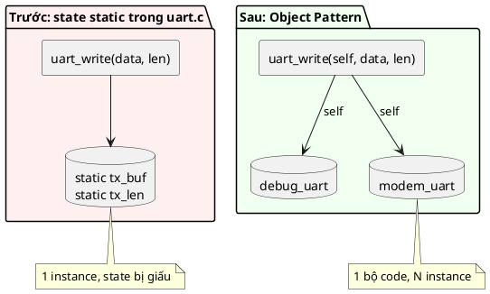

# 01 — Object Pattern

📖 Bài giảng chi tiết: [LECTURE.md](LECTURE.md). File này là ghi chú tóm tắt.

> Chương Introduction chỉ nói: đây là pattern **quan trọng nhất trong C nhưng bị dùng quá ít**; áp dụng vào code rối thì "mọi thứ vào đúng chỗ" — gỡ dependency, bắt buộc refactor hợp lý, code rõ ràng hơn.
> Phần còn lại dưới đây là kiến thức chung, **không trích từ sách** (chưa có chương chi tiết).

## Overview

Gom **toàn bộ state** của một module vào một `struct`, và mọi hàm của module nhận **con trỏ tới struct đó** (`self`) làm tham số đầu tiên. Không còn biến `static`/global trong file `.c`.



## Code "trước khi có pattern"

```c
/* uart.c */
static uint8_t tx_buf[32];
static size_t tx_len;

int uart_write(const uint8_t *data, size_t len) { ... dùng tx_buf, tx_len ... }
```

Vấn đề:
- Chỉ có **một** UART. Board có UART0 + UART1 thì phải copy file thành `uart0.c`, `uart1.c`.
- State ẩn: nhìn chữ ký hàm không biết nó đọc/ghi dữ liệu gì → khó debug.
- Khó unit test: state còn sót lại từ test trước, không reset được.
- Không rõ ai sở hữu bộ nhớ, init lúc nào.

## Use Cases

Hầu như mọi module có state: driver (UART, SPI, I2C, GPIO), sensor, ring buffer, state machine, PID controller, protocol parser.

## Benefits

- Nhiều instance từ một bộ code.
- Dependency hiện rõ ra ở chữ ký hàm.
- Caller quyết định object nằm ở đâu (static, stack, trong struct khác) → không cần `malloc`.
- Dễ test: tạo object mới cho mỗi test case.

## Drawbacks

- Thêm một tham số con trỏ cho mọi hàm (chi phí nhỏ: truyền qua thanh ghi).
- Các field trong struct vẫn **public** — caller có thể sửa `tx_len` trực tiếp. → Bài 02 (Opaque) giải quyết chuyện này.

## Implementation

Xem [inc/uart.h](inc/uart.h), [src/uart.c](src/uart.c), [main.c](main.c).

Các quy tắc:
1. `struct <module>` chứa toàn bộ state.
2. `<module>_init(self, ...)` / `<module>_deinit(self)` — object luôn được init trước khi dùng.
3. Mọi hàm: `<module>_<action>(struct <module> *self, ...)`.
4. Hàm trả về `int`: `0` = OK, âm = lỗi (`-EINVAL`, `-ENOSPC`).

## Best Practices

- Kiểm tra `self != NULL` ở các hàm public.
- `init` phải xóa sạch struct (`memset`) vì object trên stack chứa rác.
- Không truy cập field của struct từ bên ngoài module, dù C cho phép.

## Common Pitfalls

- Quên gọi `init` → dùng dữ liệu rác.
- Vẫn để lại một biến `static` "cho tiện" trong `.c` → hai instance dùng chung state một cách bí mật.
- Copy struct bằng `=` (`struct uart b = a;`) → hai object dùng chung con trỏ bên trong, dễ lỗi.

## Alternatives

- Module chỉ có một instance thật sự → Singleton (bài 03), nhưng vẫn nên viết theo Object Pattern bên dưới.
- Muốn giấu field → Opaque (bài 02).

## Quiz

1. Tại sao Object Pattern giúp unit test dễ hơn so với biến `static` trong file `.c`?
2. Hàm `uart_write(struct uart *self, ...)` — ai cấp phát bộ nhớ cho `self`? Có những lựa chọn nào?
3. Nếu `uart.c` vẫn còn một biến `static int error_count;` thì chuyện gì xảy ra khi có 2 instance?
4. Object Pattern còn hở chỗ nào mà Opaque Pattern sẽ vá?

## Bài tập

Viết module `struct led` theo Object Pattern (tự làm trong thư mục này, đặt `inc/led.h`, `src/led.c`):
- `led_init(self, pin, active_low)`, `led_on`, `led_off`, `led_toggle`, `led_is_on`.
- `active_low = true` nghĩa là ghi 0 ra chân pin thì LED sáng.
- Mô phỏng việc ghi pin bằng `printf("pin %u = %u\n", ...)`.
- Trong `main.c` tạo 2 LED (một active-high, một active-low) và chứng minh chúng độc lập.

## Câu hỏi còn thắc mắc

-
