# Bài giảng 02 — Opaque Pattern

> **Về nguồn:** Bài này bám theo chương *Opaque Pattern* trong sách của Martin Schröder (bản 0.38.0, file `00_Document/Martin-Schroder-Design-Patterns-Opaque-Pattern-0.38.0.pdf`).
> - 📖 đánh dấu nội dung **theo sách** (dịch và diễn giải lại).
> - 💡 đánh dấu phần **giải thích thêm**, không có trong sách.
> - 🔬 đánh dấu **thí nghiệm thật**: chương trình đã được build bằng gcc 16.2 (MSYS2 UCRT64, Windows 64-bit) và chạy; output in trong bài là output thật.

Code mẫu đi kèm: [inc/uart.h](inc/uart.h), [src/uart.c](src/uart.c), [src/uart_hw.h](src/uart_hw.h), [main.c](main.c). Ghi chú ngắn: [README.md](README.md).
Bài trước: [01 — Object Pattern](../01_ObjectPattern/LECTURE.md).

---

## Mục lục

**Phần A — Kiến thức nền**

1. [Bối cảnh: lỗ hổng còn lại của Object Pattern](#1-bối-cảnh-lỗ-hổng-còn-lại-của-object-pattern)
2. [Compiler nhìn thấy gì: translation unit](#2-compiler-nhìn-thấy-gì-translation-unit)
3. [Khai báo, định nghĩa và incomplete type](#3-khai-báo-định-nghĩa-và-incomplete-type)
4. [Con trỏ chỉ là một địa chỉ](#4-con-trỏ-chỉ-là-một-địa-chỉ)
5. [Compiler cần biết gì để dịch `p->field`](#5-compiler-cần-biết-gì-để-dịch-p-field)
6. [Bản đồ bộ nhớ của vi điều khiển](#6-bản-đồ-bộ-nhớ-của-vi-điều-khiển)

**Phần B — Pattern**

7. [Vấn đề: struct nằm trong header](#7-vấn-đề-struct-nằm-trong-header)
8. [Ý tưởng cốt lõi: chỉ khai báo trong header](#8-ý-tưởng-cốt-lõi-chỉ-khai-báo-trong-header)
9. [5 đặc điểm nhận dạng và lý do của từng cái](#9-5-đặc-điểm-nhận-dạng-và-lý-do-của-từng-cái)
10. [Bài toán cấp phát: stack, heap, tĩnh](#10-bài-toán-cấp-phát-stack-heap-tĩnh)

**Phần C — Đọc code**

11. [Đọc code mẫu từng dòng](#11-đọc-code-mẫu-từng-dòng)
12. [Theo dõi demo chạy từng bước](#12-theo-dõi-demo-chạy-từng-bước)
13. [Các quyết định thiết kế và phương án khác](#13-các-quyết-định-thiết-kế-và-phương-án-khác)

**Phần D — Thực tế và tổng kết**

14. [Opaque Pattern trong thực tế](#14-opaque-pattern-trong-thực-tế)
15. [Unit test với object bị giấu](#15-unit-test-với-object-bị-giấu)
16. [Trade-off](#16-trade-off)
17. [Khi nào không nên dùng](#17-khi-nào-không-nên-dùng)
18. [Lỗi hay gặp](#18-lỗi-hay-gặp)
19. [Quy trình refactor từ Object sang Opaque](#19-quy-trình-refactor-từ-object-sang-opaque)
20. [Câu hỏi thường gặp (FAQ)](#20-câu-hỏi-thường-gặp-faq)
21. [Tóm tắt và checklist](#21-tóm-tắt-và-checklist)
22. [Quiz (có đáp án)](#22-quiz-có-đáp-án)
23. [Bài tập](#23-bài-tập)

---

# Phần A — Kiến thức nền

Opaque Pattern dựa hoàn toàn vào cách compiler C xử lý file và kiểu dữ liệu. Hiểu kỹ phần này thì phần pattern ở sau sẽ trở nên hiển nhiên.

## 1. Bối cảnh: lỗ hổng còn lại của Object Pattern

### 1.1. Nhìn lại: bài 1 đã giải quyết được gì

Sau bài 1, driver UART trông như sau:

```c
/* uart.h — kết quả của bài 1 */
#define UART_TX_BUF_SIZE 32

struct uart {
	const char *name;
	uint32_t baudrate;
	uint8_t tx_buf[UART_TX_BUF_SIZE];
	size_t tx_len;
};

int uart_init(struct uart *self, const char *name, uint32_t baudrate);
int uart_write(struct uart *self, const uint8_t *data, size_t len);
int uart_flush(struct uart *self);
```

Object Pattern đã giải được các vấn đề của biến `static`:

| Vấn đề trước bài 1 | Object Pattern giải quyết bằng |
|---|---|
| Chỉ có một instance | Mỗi `struct uart` là một instance |
| State ẩn, không biết hàm sửa gì | Mọi state đi qua `self`, nhìn chữ ký hàm là biết |
| Khó test | Mỗi test tạo object mới |
| Vòng đời không rõ | Có `init`/`deinit` |

Nhưng có một thứ bài 1 **chưa** giải quyết, và ở bài giảng 01 (mục 4, quy tắc 9) mình đã báo trước: *"bên ngoài module không đụng vào field của struct. Ở Object Pattern, đây chỉ là quy ước, compiler không chặn."*

📖 Chương *Object Pattern* của sách cũng ghi nhận đúng điều này, ở vị trí **nhược điểm đầu tiên**: **"No ability to hide implementation"**. Khi struct được định nghĩa trong header, mọi field private đều bị lộ ra, và điều này *"thêm dependency vào code dùng struct của ta"*.

Câu này chứa **hai** vấn đề khác nhau:
1. **Field bị lộ** → ai cũng sửa được dữ liệu bên trong.
2. **Dependency bị lộ** → ai include header cũng bị kéo theo những thứ struct phụ thuộc.

Thoạt nghe cả hai có vẻ chỉ là chuyện "sạch sẽ". Để thấy chúng gây hại thật thế nào, hãy theo dõi một dự án qua thời gian.

### 1.2. Một dự án lớn dần: hai lỗ hổng gây hại ra sao

💡 *Tình huống minh họa (không phải ví dụ trong sách), nhưng rất điển hình trong các dự án firmware.*

#### Tháng 1: mọi thứ ổn

Một team 3 người làm firmware cho bộ thu GPS. Driver UART viết theo Object Pattern như trên. `gps.c`, `logger.c`, `main.c` đều include `uart.h` và gọi qua API. Không ai đụng vào field.

#### Tháng 3: một "bản sửa nhanh"

Một đồng nghiệp cần hàm hủy các lệnh GPS đang chờ gửi. Không có API nào làm việc đó, và deadline đang tới. Struct nằm ngay trong header, nên viết luôn:

```c
/* gps.c */
void gps_cancel_pending(struct gps *self)
{
	self->uart->tx_len = 0;   /* bỏ qua dữ liệu đang chờ gửi */
}
```

Compiler không phàn nàn. Code chạy đúng. Review cũng cho qua, vì nhìn rất vô hại.

#### Tháng 5: driver UART được nâng cấp

Tác giả driver UART chuyển sang gửi bằng **DMA** để giảm tải CPU. Struct thêm field mới, và có một **bất biến** (invariant) mới: *trong lúc DMA đang chạy, `tx_len` phải giữ nguyên*, vì DMA đang đọc từ `tx_buf` dựa trên giá trị đó.

```c
struct uart {
	const char *name;
	uint32_t baudrate;
	uint8_t tx_buf[UART_TX_BUF_SIZE];
	size_t tx_len;
	bool tx_busy;     /* mới: DMA đang gửi */
};
```

Tác giả driver kiểm tra kỹ **mọi hàm trong `uart.c`**, đảm bảo không hàm nào sửa `tx_len` khi `tx_busy`. Nhưng anh ấy **không có cách nào biết** `gps.c` cũng đang sửa `tx_len`.

#### Tháng 6: bug "ngẫu nhiên"

Thỉnh thoảng thiết bị gửi ra các câu lệnh GPS bị cắt cụt hoặc lẫn rác. Chỉ xảy ra khi người dùng bấm hủy đúng lúc đang gửi. Team mất cả tuần mới lần ra dòng `self->uart->tx_len = 0;` trong `gps.c`.

**Bài học:** lỗi không nằm ở người viết `gps.c` hay người viết `uart.c`. Lỗi nằm ở chỗ **ngôn ngữ cho phép** một module phá bất biến của module khác mà không ai được báo. Quy ước "đừng đụng vào field" không sống sót được qua deadline và qua việc thay người.

#### Tháng 8: đổi chip

Nhà cung cấp hết hàng STM32F4, team phải chuyển sang một dòng chip khác. Driver UART thật có field thanh ghi kiểu `USART_TypeDef *`, nên `uart.h` phải `#include "stm32f4xx_hal.h"`. Hệ quả:
- **Mọi** file include `uart.h` (`gps.c`, `logger.c`, `main.c`, các file test...) đều đã gián tiếp include header HAL.
- Theo thời gian, vài file đã **vô tình dùng luôn** macro và kiểu của HAL (`HAL_Delay`, `GPIO_PIN_SET`...) vì chúng "tự nhiên có sẵn".
- Đổi chip bây giờ không chỉ là viết lại `uart.c`, mà phải đi sửa khắp project.

Thêm vào đó, mỗi lần ai sửa `struct uart` (như thêm `tx_busy` ở tháng 5), **mọi file include `uart.h` đều phải build lại**, dù chúng chỉ gọi `uart_write`.

#### Nhìn lại

| Tháng | Chuyện gì xảy ra | Lỗ hổng gây ra |
|---|---|---|
| 3 | `gps.c` sửa thẳng `tx_len` | **Field bị lộ** |
| 5–6 | Thêm DMA, bất biến bị phá, bug khó tìm | **Field bị lộ** |
| 8 | Đổi chip phải sửa khắp nơi; sửa struct là build lại cả project | **Dependency bị lộ** |

Opaque Pattern sinh ra để chặn đúng hai lỗ hổng này **bằng compiler**, không bằng quy ước.

### 1.3. Đọc kỹ định nghĩa của sách

📖 Sách định nghĩa:

> *"Opaque pattern is an extension of the object pattern where we make the object data structure fully private and not visible outside of the implementation."*
>
> *Opaque pattern là phần mở rộng của Object Pattern, trong đó struct dữ liệu của object được làm **hoàn toàn private**, không nhìn thấy được từ bên ngoài phần implementation.*

Từng vế:

| Vế | Nghĩa là gì |
|---|---|
| *"an extension of the object pattern"* | Không thay thế bài 1 mà **xây thêm lên trên**. Mọi thứ của bài 1 (`self`, `init`/`deinit`, tiền tố tên, trả mã lỗi, không có state `static`) vẫn giữ nguyên |
| *"the object data structure"* | Thứ bị giấu là **định nghĩa struct**, tức danh sách field. Các **hàm** vẫn public như cũ |
| *"fully private"* | Không phải "xin đừng đụng vào" mà là **không thể** đụng vào. Không đọc, không ghi, không biết kích thước |
| *"not visible outside of the implementation"* | "Implementation" ở đây là **file `.c` của module**. Ra khỏi file đó là không thấy |

Viết gọn thành công thức:

> **Opaque = Object Pattern + định nghĩa struct chuyển từ `.h` vào `.c`**

Nghe đơn giản, nhưng chính việc di chuyển này kéo theo cả một loạt hệ quả: caller không tự cấp phát được nữa, cần hàm `new`/`free`, cần getter, không lồng struct được... Phần lớn bài học này là về các hệ quả đó.

📖 Sách cũng nói thêm: *"có nhiều cách để giấu implementation, và trong module này ta sẽ xem cách làm"*. Cách chính là định nghĩa struct trong `.c`; còn bài toán phát sinh là cấp phát, với 3 phương án (mục 10).

### 1.4. Opaque trong bức tranh các Creational Pattern

📖 Sách xếp Object, Opaque, Singleton và Factory vào nhóm **Creational Patterns** (pattern về việc *tạo ra* object). Ba pattern đầu là các nấc **giấu dần** của cùng một ý tưởng:

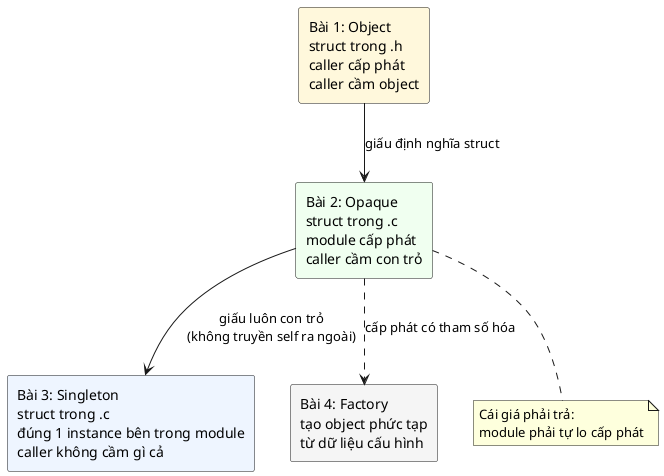

| | Object (bài 1) | Opaque (bài 2) | Singleton (bài 3) |
|---|---|---|---|
| Caller thấy field? | Thấy | **Không** | Không |
| Ai cấp phát? | Caller | **Module** (hoặc caller qua `size()`) | Module |
| Số instance | Tùy ý | Tùy ý | **Đúng 1** |
| Caller cầm gì? | Object hoặc con trỏ | **Con trỏ** | Không cầm gì |
| Hàm nhận `self`? | Có | **Có** | Bên ngoài không; bên trong nên có |

📖 Sách phân biệt rõ Opaque và Singleton: nếu module giấu struct **nhưng hàm không nhận `self`** (dùng một instance cố định bên trong), thì *"nhiều khả năng ta đang nhìn thấy Singleton Pattern"*.

### 1.5. Câu hỏi bài này sẽ trả lời

1. C không có từ khóa `private`, vậy **làm sao giấu** được field? (Phần A, mục 2–5)
2. Nếu caller không biết struct lớn bao nhiêu, thì **ai cấp phát, ở đâu**? (Mục 10)
3. Mất khả năng đọc field thì **test** thế nào? (Mục 15)
4. Opaque tốn gì, và **khi nào không nên dùng**? (Mục 16–17)

Câu hỏi đầu tiên là nền tảng của mọi thứ. Câu trả lời không nằm ở cú pháp đặc biệt nào, mà nằm ở **cách compiler C làm việc**. Đó là nội dung của mục 2–5 dưới đây.

---

## 2. Compiler nhìn thấy gì: translation unit

### Mỗi file `.c` được dịch hoàn toàn riêng biệt

Khi bạn gõ `make`, lệnh thật sự chạy là:

```sh
gcc -std=c99 -Wall -Wextra -Werror -pedantic -Iinc main.c src/uart.c -o demo
```

Trông như một lệnh, nhưng gcc làm **hai lần dịch độc lập**, rồi mới nối lại:

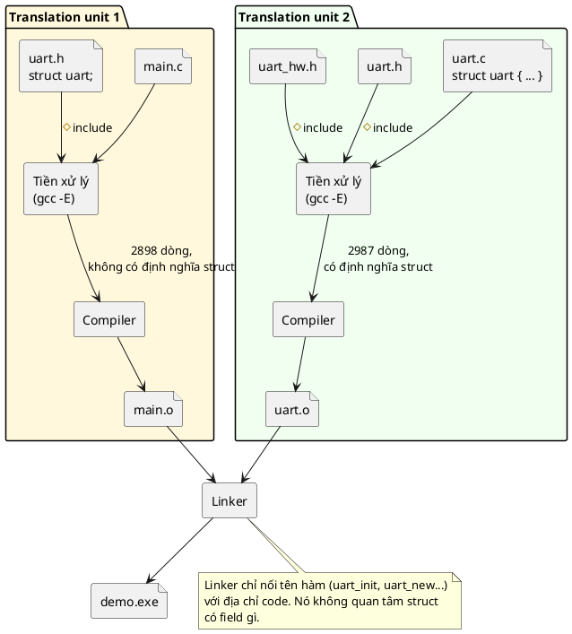

Các bước:

1. **Tiền xử lý (preprocessor):** dán nội dung mọi file `#include` vào chỗ của nó, thay macro. Kết quả là một khối văn bản lớn gọi là **translation unit** (đơn vị dịch).
2. **Compile:** dịch translation unit thành mã máy, ra file `.o` (object file). **Compiler chỉ biết những gì có trong translation unit đó**, không biết gì về file `.c` khác.
3. **Link:** linker ghép các `.o` lại. Chỗ nào `main.o` gọi `uart_new`, linker điền địa chỉ thật của hàm `uart_new` trong `uart.o`. Linker làm việc với **tên** (symbol), không làm việc với kiểu dữ liệu.

### 🔬 Thí nghiệm: `main.c` thật sự nhìn thấy gì?

Lệnh `gcc -E` dừng sau bước tiền xử lý và in ra translation unit. Mình đếm trong kết quả:

```
main.c sau tiền xử lý: 2898 dòng, 'uart_hw_regs' xuất hiện 0 lần, 'struct uart {' xuất hiện 0 lần
uart.c sau tiền xử lý: 2987 dòng, 'uart_hw_regs' xuất hiện 2 lần, 'struct uart {' xuất hiện 1 lần
```

(Gần 3000 dòng là do `<stdio.h>`, `<string.h>`... cũng được dán vào.)

Những dòng liên quan tới `struct uart` mà compiler thấy khi dịch `main.c`:

```c
struct uart;
struct uart *uart_new(void);
void uart_free(struct uart **self);
struct uart *uart_pool_get(void);
void uart_pool_put(struct uart **self);
```

**Đây là toàn bộ bí mật của Opaque Pattern:** định nghĩa struct nằm trong `uart.c`, nên nó **chỉ tồn tại trong translation unit 2**. Khi dịch `main.c`, compiler đơn giản là chưa từng thấy nó. Không cần từ khóa đặc biệt nào.

---

## 3. Khai báo, định nghĩa và incomplete type

### Hai việc khác nhau

```c
struct uart;              /* KHAI BÁO (declaration): "tồn tại một kiểu tên là struct uart" */

struct uart {             /* ĐỊNH NGHĨA (definition): "struct uart gồm các field này" */
	uint32_t baudrate;
	size_t tx_len;
};
```

- **Khai báo** chỉ giới thiệu **tên**. Dòng `struct uart;` còn được gọi là *forward declaration* (khai báo trước).
- **Định nghĩa** cho biết **nội dung**: có những field nào, kiểu gì, và từ đó suy ra kích thước.

### Incomplete type

Chuẩn C gọi một kiểu đã được khai báo nhưng chưa được định nghĩa là **incomplete type** (kiểu chưa hoàn chỉnh). 💡 Thật ra bạn đã gặp incomplete type nhiều lần mà không để ý:

| Incomplete type | Ví dụ | Ghi chú |
|---|---|---|
| Struct chỉ khai báo | `struct uart;` | Thứ Opaque Pattern dùng |
| `void` | `void *p;` | `void` là incomplete type **không bao giờ hoàn chỉnh được**. Vì vậy không có biến kiểu `void`, không `*p` được với `void *p` |
| Mảng chưa rõ kích thước | `extern uint8_t buf[];` | Biết là mảng `uint8_t`, chưa biết bao nhiêu phần tử |

Một incomplete type có thể **trở thành hoàn chỉnh** ở chỗ định nghĩa. Trong `uart.c`, sau khi gặp `struct uart { ... };`, compiler coi `struct uart` là hoàn chỉnh cho phần còn lại của file đó. Trong `main.c` thì nó mãi mãi incomplete.

---

## 4. Con trỏ chỉ là một địa chỉ

Tại sao compiler cho phép khai báo `struct uart *p;` khi chưa biết `struct uart` là gì?

Vì con trỏ chỉ là **một con số**: địa chỉ của một ô nhớ. Dù trỏ tới struct 1 byte hay 1000 byte, con số đó luôn có cùng độ dài.

🔬 Thí nghiệm:

```c
#include <stdio.h>

struct uart;                        /* incomplete: không biết bên trong có gì */
struct big { char data[1000]; };    /* complete: 1000 byte */

int main(void)
{
	printf("sizeof(struct uart *) = %u\n", (unsigned)sizeof(struct uart *));
	printf("sizeof(struct big *)  = %u\n", (unsigned)sizeof(struct big *));
	printf("sizeof(struct big)    = %u\n", (unsigned)sizeof(struct big));
	return 0;
}
```

Output:

```
sizeof(struct uart *) = 8
sizeof(struct big *)  = 8
sizeof(struct big)    = 1000
```

- Trên PC 64-bit, mọi con trỏ là **8 byte**, kể cả con trỏ tới kiểu incomplete.
- 💡 Trên ARM Cortex-M (32-bit), mọi con trỏ là **4 byte**.

💡 Chuẩn C bảo đảm điều này cụ thể cho struct: *mọi con trỏ tới struct có cùng cách biểu diễn và yêu cầu căn lề*. Nhờ vậy compiler xử lý được con trỏ tới struct mà không cần biết bên trong struct có gì.

Với một con trỏ tới incomplete type, compiler làm được mọi việc **chỉ cần tới địa chỉ**:

| Thao tác | Cho phép? | Compiler cần biết gì |
|---|---|---|
| `struct uart *p;` | ✅ | Kích thước con trỏ: luôn biết |
| `p = uart_new();` | ✅ | Copy một địa chỉ |
| `uart_write(p, ...)` | ✅ | Đẩy một địa chỉ vào thanh ghi `r0` |
| `if (p == NULL)` | ✅ | So sánh hai địa chỉ |
| `p->tx_len` | ❌ | **Offset** của `tx_len` trong struct |
| `struct uart u;` | ❌ | **Kích thước** struct để dành chỗ |
| `sizeof(struct uart)` | ❌ | **Kích thước** struct |
| `p + 1` | ❌ | **Kích thước** struct để nhảy qua một phần tử |

---

## 5. Compiler cần biết gì để dịch `p->field`

### `p->field` thực chất là "địa chỉ + offset"

Khi compiler dịch `self->tx_len = 0;`, nó sinh ra lệnh máy kiểu:

```
ghi 0 vào ô nhớ tại địa chỉ (self + 56)
```

Con số **56** là **offset** của `tx_len` trong struct. Muốn biết offset, compiler phải biết **toàn bộ các field đứng trước** và kích thước của chúng.

### 🔬 Bố cục thật của `struct uart` trong code mẫu

Mình dùng macro `offsetof` (trong `<stddef.h>`) để in vị trí từng field. Output thật:

```
name     offset  0  size  8
baudrate offset  8  size  4
regs     offset 12  size  8
tx_buf   offset 20  size 32
tx_len   offset 56  size  8
sizeof(struct uart) = 64
```

| Offset | Kích thước | Field | Ghi chú |
|---|---|---|---|
| 0 | 8 | `name` | Con trỏ 64-bit |
| 8 | 4 | `baudrate` | `uint32_t` |
| 12 | 8 | `regs` | 2 × `uint32_t` (BRR, DR) |
| 20 | 32 | `tx_buf` | `uint8_t[32]` |
| **52** | **4** | **(padding)** | Byte đệm, không dùng |
| 56 | 8 | `tx_len` | `size_t` 64-bit |
| | **64** | | 60 byte dữ liệu + 4 byte padding |

💡 **Padding là gì?** `tx_buf` kết thúc ở byte 52. Nhưng `tx_len` là số 8 byte, và CPU đọc số 8 byte nhanh nhất (có CPU chỉ đọc được) khi địa chỉ **chia hết cho 8**. 52 không chia hết cho 8, nên compiler chèn 4 byte trống để `tx_len` bắt đầu ở 56. Đây là **alignment** (căn lề).

💡 Trên Cortex-M 32-bit, con trỏ và `size_t` chỉ có 4 byte, nên bố cục và kích thước sẽ khác. Đây chính là lý do caller **không được tự đoán** kích thước struct: nó phụ thuộc vào chip, compiler và cờ build.

### Vì sao `main.c` bị báo lỗi

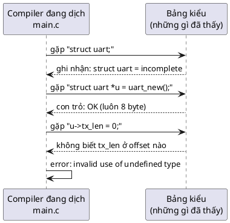

Compiler không "cấm" vì một quy tắc bảo mật nào. Nó **không thể** sinh mã máy, vì nó không biết con số offset. Đó là lý do việc giấu này **chắc chắn**: không có cách nào "lách" bằng cú pháp thông thường.

---

## 6. Bản đồ bộ nhớ của vi điều khiển

Phần cấp phát (mục 10) liên tục nhắc tới stack, heap, `.bss`. Đây là tổng quan về nơi mỗi thứ nằm trên một vi điều khiển điển hình:

| Vùng nhớ | Nằm ở | Chứa gì | Ví dụ trong bài |
|---|---|---|---|
| `.text` | Flash | Code (lệnh máy) | `uart_init()`, `uart_write()` |
| `.rodata` | Flash | Hằng số chỉ đọc | Chuỗi `"UART0"`, bảng `static const` |
| `.data` | RAM (giá trị ban đầu chép từ Flash lúc khởi động) | Biến `static`/global có giá trị khởi tạo khác 0 | Không có trong bài |
| `.bss` | RAM (xóa về 0 lúc khởi động) | Biến `static`/global khởi tạo bằng 0 | `uart_pool[]`, `uart_pool_used[]` |
| Heap | RAM | Vùng `malloc`/`free` cấp phát lúc chạy | Object từ `uart_new()` |
| Stack | RAM | Biến cục bộ, tham số, địa chỉ return, `alloca` | Object từ `alloca(uart_size())` |

💡 Điểm quan trọng:
- Kích thước `.text`, `.rodata`, `.data`, `.bss` **biết chính xác lúc build**. Linker in ra, và báo lỗi nếu vượt quá Flash/RAM của chip.
- Kích thước heap và stack **được dành sẵn** trong linker script (ví dụ heap 4 KB, stack 2 KB). Nhưng **dùng bao nhiêu trong đó** thì chỉ biết lúc chạy. Hết heap thì `malloc` trả `NULL`. Hết stack thì **tràn sang vùng khác**, thường không có báo lỗi nào.

Đó là lý do người làm embedded thích mọi thứ nằm ở `.bss` (cấp phát tĩnh): RAM dùng bao nhiêu biết ngay lúc build.

---

# Phần B — Pattern

## 7. Vấn đề: struct nằm trong header

Giả sử driver UART của bài 1 chạy trên chip thật. Struct cần chứa thanh ghi phần cứng, mà kiểu thanh ghi do header của vendor định nghĩa:

```c
/* uart.h — kiểu Object Pattern */
#include "stm32f4xx_hal.h"     /* bắt buộc: struct bên dưới dùng kiểu của vendor */

struct uart {
	USART_TypeDef *regs;
	uint8_t tx_buf[32];
	size_t tx_len;
};
```

Vì sao `uart.h` **bắt buộc** include header vendor? Vì theo mục 5, muốn định nghĩa struct, compiler phải biết kiểu của **mọi field**. Thiếu định nghĩa `USART_TypeDef` thì không định nghĩa được `struct uart`. 💡 (Riêng field là *con trỏ* như `USART_TypeDef *regs` thì về lý thuyết chỉ cần khai báo trước kiểu đó. Nhưng `USART_TypeDef` trong HAL là một `typedef` của struct không tên, nên không khai báo trước được. Và nếu field là struct nằm thẳng trong object, như `regs` trong code mẫu, thì bắt buộc phải có định nghĩa đầy đủ.)

Hệ quả là hai vấn đề:

### Vấn đề 1: Caller sửa được field trực tiếp

```c
debug_uart.tx_len = 0;    /* compiler cho phép */
```

Module mất quyền kiểm soát tính đúng đắn của dữ liệu. Ví dụ, nếu caller đặt `tx_len = 100` (lớn hơn buffer 32 byte), thì `UART_TX_BUF_SIZE - self->tx_len` trong `uart_write` bị **tràn số không dấu** thành một số rất lớn, phép kiểm tra luôn đậu, và `memcpy` ghi đè bộ nhớ.

### Vấn đề 2: Dependency bị rò rỉ qua header

📖 Sách nhấn mạnh đây là lý do chính: *"struct thường chứa cấu trúc dữ liệu đặc thù của implementation và cần include header đặc thù của implementation, và những header đó cũng bị include vào code dùng header của ta."*

Hệ quả cụ thể:
- `main.c`, `gps.c`, `logger.c` chỉ muốn gửi vài byte qua UART, nhưng đều bị **kéo theo toàn bộ header HAL của STM32**.
- 💡 Mỗi lần sửa header vendor (hay chỉ thêm một field vào `struct uart`), **mọi file include `uart.h` đều phải build lại**.
- 💡 Header vendor định nghĩa rất nhiều macro (`SET`, `RESET`, `ERROR`, `READ_BIT`, ...), dễ **xung đột tên** với code khác.
- 💡 Code ứng dụng vô tình dùng kiểu của vendor, nên **bị trói vào một dòng chip**. Muốn chuyển sang chip khác thì phải sửa khắp nơi.

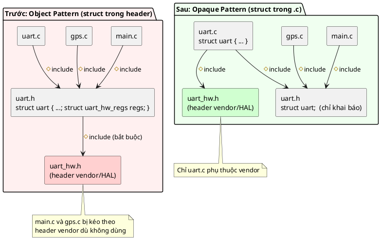

📖 Sách gọi việc này là tạo một **"dependency barrier"** (hàng rào dependency): giữ dependency nằm gọn bên trong implementation.

---

## 8. Ý tưởng cốt lõi: chỉ khai báo trong header

Ghép kiến thức nền lại:
- Header chỉ chứa **khai báo** `struct uart;` (mục 3).
- **Định nghĩa** nằm trong `uart.c`, nên chỉ tồn tại trong translation unit của `uart.c` (mục 2).
- Mọi file khác chỉ thấy incomplete type, nên **chỉ cầm được con trỏ** (mục 4), không đọc được field (mục 5).

### 🔬 Lỗi compiler thật

Mình cố tình viết code sai trong một file bên ngoài `uart.c`:

```c
void bad_field_access(struct uart *uart) { uart->tx_len = 0; }
void bad_stack_object(void)              { struct uart u; (void)u; }
size_t bad_sizeof(void)                  { return sizeof(struct uart); }
```

Output của gcc:

```
bad.c:5:13: error: invalid use of undefined type 'struct uart'
    5 |         uart->tx_len = 0;
bad.c:10:21: error: storage size of 'u' isn't known
   10 |         struct uart u;
bad.c:16:23: error: invalid application of 'sizeof' to incomplete type 'struct uart'
   16 |         return sizeof(struct uart);
```

Ba thông báo này khớp đúng ba dòng ❌ trong bảng ở mục 4:
- `invalid use of undefined type`: không biết offset của field.
- `storage size of 'u' isn't known`: không biết phải dành bao nhiêu byte.
- `invalid application of 'sizeof'`: không biết kích thước.

Đây là điểm khác biệt quan trọng nhất so với bài 1: quy tắc "không đụng vào field" giờ được **compiler ép buộc**, không còn dựa vào kỷ luật của người viết code.

📖 Sách: *"Đây là cách chính để giấu implementation trong C mà vẫn dùng được con trỏ tới struct opaque ở phần còn lại của code."*

### Ai thấy gì

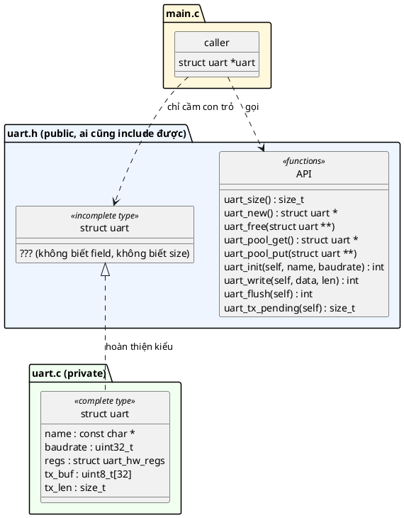

💡 So sánh với C++: đây chính là thứ C++ gọi là **PIMPL idiom** (*pointer to implementation*). Lập trình viên C++ cũng dùng nó vì cùng lý do: từ khóa `private` của C++ giấu được quyền **truy cập**, nhưng không giấu được **dependency**. Field private vẫn nằm trong header, nên vẫn kéo theo include và vẫn bắt build lại.

---

## 9. 5 đặc điểm nhận dạng và lý do của từng cái

📖 Sách liệt kê 5 đặc điểm (*Defining Characteristics*). Đây là "dấu vân tay" để nhận ra Opaque Pattern trong code người khác.

### 1. Định nghĩa struct nằm trong file `.c`

Header chỉ có `struct uart;`. Định nghĩa đầy đủ nằm trong `uart.c`.

**Tại sao:** đây chính là cơ chế giấu (mục 2).

### 2. Implementation phải cho biết kích thước (hoặc tự lo cấp phát)

**Tại sao:** caller không biết `sizeof(struct uart)` nên không thể tự khai báo `struct uart u;` như bài 1. Implementation phải hoặc cung cấp hàm `uart_size()`, hoặc tự cấp phát giúp caller. Mục 10 sẽ nói chi tiết.

💡 Chú ý: `uart_size()` là **hàm**, không phải macro hay hằng. Giá trị của nó được tính trong `uart.c` (nơi thấy định nghĩa), rồi trả về lúc chạy. Caller vẫn không biết kích thước **lúc compile**, chỉ biết **lúc chạy**.

### 3. Bên trong vẫn dùng Object Pattern

📖 Mọi hàm vẫn nhận con trỏ `self`, nhưng **caller không còn chịu trách nhiệm cấp phát** instance nữa.

📖 Sách lưu ý: *nếu không có đặc điểm này* (tức là hàm không nhận `self` mà dùng một instance cố định bên trong `.c`) *thì nhiều khả năng ta đang nhìn thấy Singleton Pattern*, chính là bài 3.

**Tại sao:** giữ `self` thì vẫn có nhiều instance, vẫn reentrant, vẫn dễ test, tức là toàn bộ lợi ích của bài 1.

### 4. Dùng cặp `new` và `delete`/`free`

📖 Cặp hàm này để **phân biệt rõ object opaque với object thường**, và để caller biết rõ rằng **mình phải gọi free khi dùng xong**.

**Tại sao:** nhìn thấy `uart_new()` là biết ngay object nằm trên heap và phải được giải phóng. Nếu caller tự gọi `malloc(uart_size())` thì ý định đó bị chìm mất, và module mất quyền đổi cách cấp phát sau này (ví dụ chuyển sang pool mà không sửa caller).

### 5. Caller chỉ làm việc với con trỏ

📖 Bên ngoài implementation chỉ có **opaque handle**, tức là con trỏ.

**Tại sao:** đây là hệ quả tự nhiên của incomplete type (mục 4). Con trỏ là thứ duy nhất compiler cho caller cầm.

---

## 10. Bài toán cấp phát: stack, heap, tĩnh

📖 Sách nói rõ: *"Khác biệt lớn nhất giữa opaque object và object pattern truyền thống là với opaque pattern **ta phải tự lo cấp phát bộ nhớ**."*

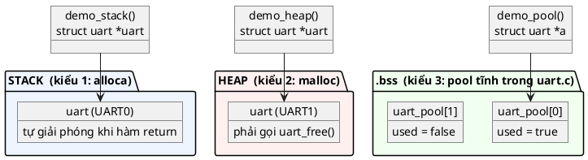

### 10.1. Kiểu 1: Cấp phát trên stack bằng `alloca`

#### Cách dùng

```c
size_t uart_size(void)
{
	return sizeof(struct uart);   /* uart.c thấy định nghĩa nên tính được */
}
```

```c
struct uart *uart = alloca(uart_size());
uart_init(uart, "UART0", 115200);
/* ... */
uart_deinit(uart);
/* bộ nhớ tự giải phóng khi hàm return */
```

📖 `alloca` giống `malloc` nhưng cấp phát **trên stack**, và **tự giải phóng khi hàm return**. Nó không bị phân mảnh như `malloc`. Sách nói cách này *"hoạt động y hệt khai báo biến trên stack, chỉ khác là kích thước lấy từ một hàm"*.

#### Chuyện gì xảy ra trên stack

💡 Mỗi lần gọi hàm, CPU dành một vùng trên stack gọi là **stack frame**, chứa địa chỉ return, tham số và biến cục bộ. Stack mọc **xuống** (về phía địa chỉ thấp). Thanh ghi **stack pointer** (SP) đánh dấu đỉnh hiện tại.

`alloca(64)` chỉ làm một việc: **lùi SP thêm 64 byte** và trả về địa chỉ đó. Không tìm kiếm, không ghi sổ sách, nên rất nhanh.

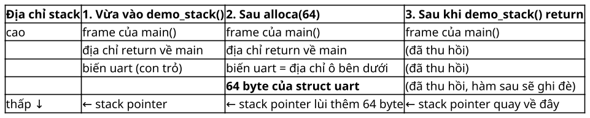

Khi `demo_stack()` return, SP nhảy về chỗ cũ. 64 byte kia **vẫn còn đó** về mặt vật lý, nhưng được coi là trống: lần gọi hàm tiếp theo sẽ ghi đè lên.

#### Nguy hiểm 1: Tràn stack

📖 Giống mọi biến trên stack, compiler **không báo** nếu stack không đủ chỗ. Bạn phải tự đảm bảo stack đủ lớn.

💡 Trên MCU không có MMU, tràn stack nghĩa là SP lùi vào vùng `.bss` hoặc heap nằm bên dưới, ghi đè biến của module khác. Triệu chứng là các bug "ngẫu nhiên" ở chỗ chẳng liên quan. Trên RTOS, mỗi task có stack riêng, thường chỉ vài trăm byte tới vài KB, nên càng phải cẩn thận.

#### Nguy hiểm 2: Trả con trỏ ra khỏi hàm

Từ hình trên, nếu trả địa chỉ của 64 byte đó ra ngoài, caller sẽ cầm một **con trỏ treo** (dangling pointer): nó trỏ vào vùng sắp bị ghi đè.

⚠️ **Đối chiếu với thực tế:** sách nói compiler sẽ *báo lỗi* (`-Werror=return-local-addr`) nếu bạn làm vậy. 🔬 Mình đã thử với gcc 16.2:

```c
struct uart *make_uart(void)
{
	struct uart *uart = alloca(uart_size());
	return uart;    /* con trỏ treo: vùng nhớ biến mất khi hàm return */
}
```

| Cờ build | Kết quả |
|---|---|
| `-Wall -Wextra` (không tối ưu, `-O0`) | **Không có cảnh báo nào** |
| `-O2 -Wall -Wextra` | `warning: function returns address of local variable [-Wreturn-local-addr]` |
| `-O2 -Wall -Wextra -Werror` | Thành lỗi, build dừng |

💡 Tại sao chỉ có ở `-O2`? Phân tích "con trỏ này đến từ `alloca`" là một phần của các bước tối ưu. Ở `-O0`, compiler không chạy các bước đó nên không phát hiện. Kết luận: **đừng trông chờ compiler bắt hộ lỗi này**.

#### Lưu ý khác về `alloca`

- 💡 `alloca` **không thuộc chuẩn C**. Mỗi nền tảng khai báo ở một chỗ: `<malloc.h>` trên Windows/MinGW, `<alloca.h>` trên Linux. Xem phần `#ifdef _WIN32` trong [main.c](main.c).
- 💡 Một số chuẩn coding (như MISRA C) cấm `alloca`.
- 💡 Không gọi `alloca` trong vòng lặp: mỗi lần gọi lại chiếm thêm stack, chỉ được trả khi **hàm** return chứ không phải khi vòng lặp xong.

#### 💡 Sao không dùng mảng `uint8_t` thay cho `alloca`?

Có người viết:

```c
uint8_t storage[uart_size()];               /* VLA: mảng có kích thước lúc chạy */
struct uart *uart = (struct uart *)storage; /* ép kiểu */
```

Đừng làm vậy:
- Mảng `uint8_t` chỉ được bảo đảm căn lề 1 byte. Struct cần căn lề 8 (trên PC). Đọc `tx_len` 8 byte ở địa chỉ lẻ là **undefined behavior**. Trên Cortex-M3/M4, các lệnh đọc/ghi nhiều word (`LDRD`, `LDM`) gặp địa chỉ không chia hết cho 4 sẽ gây **UsageFault**.
- VLA (mảng kích thước biến) là tính năng **tùy chọn** từ C11, nhiều compiler embedded không hỗ trợ.

`alloca` thì luôn trả địa chỉ căn lề đủ cho mọi kiểu.

### 10.2. Kiểu 2: Cấp phát trên heap bằng `new`/`free`

#### Cách dùng

```c
struct uart *uart_new(void)
{
	return malloc(sizeof(struct uart));
}

void uart_free(struct uart **self)
{
	if (!self) {
		return;
	}
	free(*self);
	*self = NULL;
}
```

```c
struct uart *uart = uart_new();
if (!uart) {
	/* xử lý hết bộ nhớ */
}
uart_init(uart, "UART1", 9600);
/* ... */
uart_deinit(uart);
uart_free(&uart);   /* uart == NULL sau dòng này */
```

#### Vì sao `uart_free` nhận con trỏ cấp hai `struct uart **`?

📖 Sách ghi chú ngay trong code: *"Set the passed pointer to NULL!"* Hàm cần sửa được **chính biến con trỏ của caller** thành `NULL`. Muốn hiểu vì sao phải dùng `**`, cần nhớ một quy tắc của C:

> **C luôn truyền tham số theo giá trị (by value).** Hàm nhận một **bản copy** của tham số, không phải biến gốc.

Khi bạn truyền một con trỏ, hàm nhận bản copy của **địa chỉ**. Hàm dùng địa chỉ đó để sửa **vùng nhớ được trỏ tới** thì được. Nhưng gán bản copy đó thành `NULL` thì biến gốc của caller không đổi.

🔬 Thí nghiệm so sánh hai cách:

```c
#include <stdio.h>
#include <stdlib.h>

struct thing {
	int x;
};

static void free_by_value(struct thing *p)
{
	printf("  trong free_by_value: &p = %p, p = %p\n", (void *)&p, (void *)p);
	free(p);
	p = NULL; /* chỉ xóa bản copy */
}

static void free_by_ref(struct thing **pp)
{
	printf("  trong free_by_ref:   pp = %p, *pp = %p\n", (void *)pp, (void *)*pp);
	free(*pp);
	*pp = NULL; /* xóa chính biến của caller */
}

int main(void)
{
	struct thing *a = malloc(sizeof(*a));
	struct thing *b = malloc(sizeof(*b));

	printf("main: &a = %p, a = %p\n", (void *)&a, (void *)a);
	free_by_value(a);
	printf("main sau free_by_value: a = %p\n\n", (void *)a);

	printf("main: &b = %p, b = %p\n", (void *)&b, (void *)b);
	free_by_ref(&b);
	printf("main sau free_by_ref:   b = %p\n", (void *)b);
	return 0;
}
```

Output thật:

```
main: &a = 0000008568DFF8C8, a = 000002844854C620
  trong free_by_value: &p = 0000008568DFF8A0, p = 000002844854C620
main sau free_by_value: a = 000002844854C620

main: &b = 0000008568DFF8C0, b = 0000028448549EA0
  trong free_by_ref:   pp = 0000008568DFF8C0, *pp = 0000028448549EA0
main sau free_by_ref:   b = 0000000000000000
```

Đọc từng dòng:
- `&a = ...F8C8` và `&p = ...F8A0`: **hai địa chỉ khác nhau**. `p` là một biến riêng trên stack của `free_by_value`, chỉ được chép giá trị từ `a`.
- Sau `free_by_value`, `a` vẫn là `...C620`: vùng nhớ đã free nhưng `a` vẫn trỏ vào đó. Đây là con trỏ treo.
- `pp = ...F8C0` **đúng bằng** `&b`: `pp` trỏ vào chính biến `b`. Gán `*pp = NULL` là ghi thẳng vào `b`.
- Sau `free_by_ref`, `b` là `0`, tức `NULL`.

(💡 Nói chính xác theo chuẩn C, việc dùng giá trị của một con trỏ sau khi đã `free` là hành vi không xác định. Mình in ra chỉ để minh họa, đừng làm vậy trong code thật.)

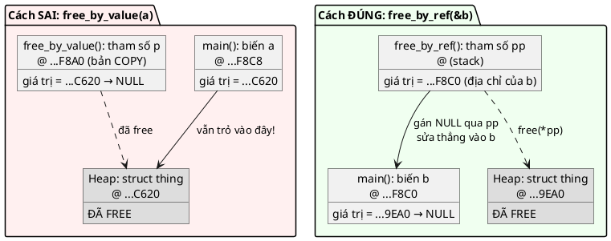

**Lợi ích thật sự** của việc đặt `NULL`: nếu sau đó có ai lỡ gọi `uart_write(uart, ...)`, hàm thấy `NULL` và trả `-EINVAL` ngay. Nếu không đặt `NULL`, `uart_write` sẽ ghi vào vùng heap mà có thể đã được cấp cho object khác. Đây là lỗi **use-after-free**: bug xuất hiện ở object khác, lúc khác, rất khó lần ra.

#### Luồng đầy đủ

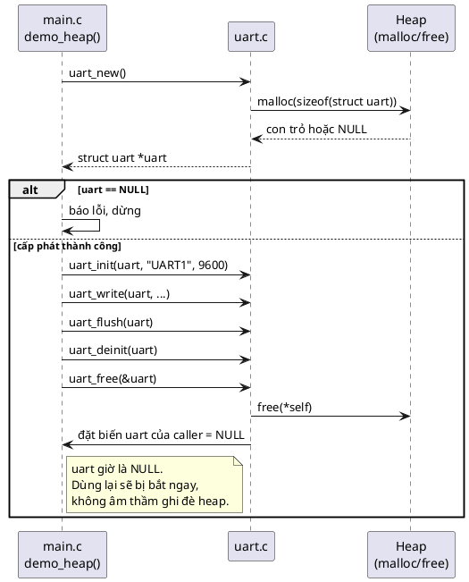

#### Vì sao heap nguy hiểm trong embedded

📖 Sách cảnh báo:
- *Trên hệ embedded, `malloc` thường bị **tắt sẵn** và luôn trả về `NULL`.*
- Nếu dùng `malloc`, phải đảm bảo **mọi object được cấp phát xong lúc khởi động**, trước khi quá trình init của ứng dụng kết thúc. Nếu không, bạn có thể đột ngột hết heap ở một thời điểm sau đó.
- **Luôn kiểm tra cấp phát thất bại.**

💡 **Phân mảnh (fragmentation)** là lý do "đột ngột hết heap". Ví dụ với heap 64 byte:

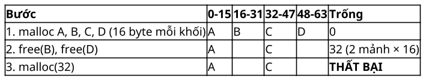

Ở bước 3, tổng chỗ trống là 32 byte, nhưng không có **32 byte liền nhau**, nên `malloc(32)` thất bại. Trên thiết bị chạy liên tục nhiều tháng, cấp phát rồi giải phóng hàng triệu lần với kích thước khác nhau, chuyện này chắc chắn sẽ xảy ra. Và nó xảy ra **sau** khi sản phẩm đã giao cho khách.

💡 Thêm vài chi phí ít người để ý:
- Mỗi khối `malloc` thường kèm **vài byte quản lý** (header ghi kích thước khối), và kích thước bị làm tròn lên. `malloc(64)` có thể chiếm 72–80 byte thật.
- Thời gian chạy của `malloc` **không cố định**: phải duyệt danh sách khối trống. Không hợp với code real-time.
- Gọi `malloc` từ nhiều thread cần lock. Gọi từ ISR thường bị cấm hẳn.

### 10.3. Kiểu 3: Cấp phát tĩnh bằng pool

📖 Sách nêu hai cách cấp phát tĩnh: **mảng tĩnh** (static array) để cấp phát và giải phóng object từ đó, hoặc **sinh code** (code generation). Code mẫu dùng mảng tĩnh.

```c
#define UART_POOL_SIZE 2

static struct uart uart_pool[UART_POOL_SIZE];
static bool uart_pool_used[UART_POOL_SIZE];

struct uart *uart_pool_get(void)
{
	for (size_t i = 0; i < UART_POOL_SIZE; i++) {
		if (!uart_pool_used[i]) {
			uart_pool_used[i] = true;
			return &uart_pool[i];
		}
	}
	return NULL;   /* hết slot */
}

void uart_pool_put(struct uart **self)
{
	if (!self || !*self) {
		return;
	}
	for (size_t i = 0; i < UART_POOL_SIZE; i++) {
		if (&uart_pool[i] == *self) {
			uart_pool_used[i] = false;
			break;
		}
	}
	*self = NULL;
}
```

Cách hoạt động:
- `uart_pool` là mảng 2 object, nằm trong `.bss` (mục 6). Kích thước biết lúc build: 2 × 64 = 128 byte trên PC.
- `uart_pool_used[i]` ghi nhận slot `i` đã có người dùng chưa.
- `get`: tìm slot trống đầu tiên, đánh dấu đã dùng, trả địa chỉ. Hết slot thì trả `NULL`.
- `put`: tìm xem con trỏ ứng với slot nào, đánh dấu trống, rồi đặt con trỏ của caller về `NULL` (cùng lý do như `uart_free`).

Vòng đời của một slot:

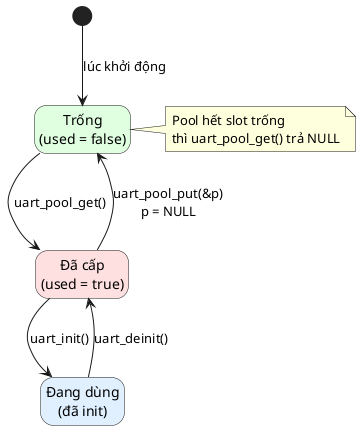

💡 **Có mâu thuẫn với bài 1 không?** Bài 1 nói "không có biến `static` trong `.c`". Ở đây có hai mảng `static`. Điểm khác là:
- Bài 1 cấm **state của object** nằm trong biến `static`, vì khi đó mọi instance ngầm dùng chung state.
- Ở đây, `uart_pool` là **kho chứa** các object. Mỗi phần tử vẫn là một object độc lập, được truy cập qua `self`. `uart_pool_used` là **state của bộ cấp phát**, không phải của UART nào.

📖 Chương Object của sách cũng thừa nhận đôi khi *"cần khai báo cấu trúc static trong file C"*, và gọi đó là *"trộn Object Pattern với Singleton ở bên trong"*.

💡 Nhược điểm của pool:
- Phải chọn `UART_POOL_SIZE` lúc build. Chọn thừa thì phí RAM, chọn thiếu thì `get` trả `NULL` lúc chạy.
- Chưa an toàn khi gọi từ nhiều thread: hai thread có thể cùng thấy slot 0 trống và cùng lấy nó (bài 11–13 sẽ giải quyết).

### 10.4. Kiểu 3 (tiếp): Sinh code lúc build

📖 Sách coi **sinh code** là cách cấp phát tĩnh tốt hơn: instance được tạo **lúc compile** từ một bản mô tả dữ liệu, nên vừa biết chính xác RAM, vừa không phải đếm tay.

#### Cách của Zephyr: device tree

📖 Zephyr RTOS mô tả phần cứng trong **device tree**. Lúc build, device tree được dịch thành macro của preprocessor, và macro sinh ra **đúng số instance cần dùng**. Đoạn rút gọn từ driver PWM STM32 mà sách trích:

```c
#define PWM_DEVICE_INIT(index)                                         \
	static struct pwm_stm32_data pwm_stm32_data_##index;           \
	static const struct pwm_stm32_config pwm_stm32_config_##index = { \
		.timer = (TIM_TypeDef *)DT_REG_ADDR(DT_PARENT(DT_DRV_INST(index))), \
		/* ... */                                                  \
	};                                                             \
	DEVICE_DT_INST_DEFINE(index, &pwm_stm32_init, NULL,            \
			      &pwm_stm32_data_##index,                 \
			      &pwm_stm32_config_##index, POST_KERNEL,  \
			      CONFIG_KERNEL_INIT_PRIORITY_DEVICE,      \
			      &pwm_stm32_driver_api);

DT_INST_FOREACH_STATUS_OKAY(PWM_DEVICE_INIT)
```

📖 Board có 3 timer PWM bật trong device tree thì có đúng 3 instance, sinh tự động lúc compile. 📖 Zephyr còn có linker script riêng để phần lớn việc khởi tạo **tự chạy trước cả `main()`**.

#### 💡 Tự làm bằng C thuần: X-macro

Không có Zephyr vẫn sinh code được bằng preprocessor, với kỹ thuật **X-macro**. Ý tưởng: viết danh sách instance **một lần** trong một file, rồi `#include` file đó nhiều lần, mỗi lần định nghĩa lại macro để sinh ra một thứ khác nhau.

**Bước 1:** danh sách instance, file `uart_instances.def`:

```c
/* Danh sách UART của board: thêm/bớt instance chỉ cần sửa file này */
/*            id     baudrate */
UART_INSTANCE(debug, 115200)
UART_INSTANCE(modem, 9600)
UART_INSTANCE(gps,   38400)
```

**Bước 2:** trong `uart.h`, sinh một hàm truy cập cho mỗi instance:

```c
struct uart;

/* Sinh một hàm truy cập cho mỗi dòng trong uart_instances.def */
#define UART_INSTANCE(id, baud) struct uart *uart_##id(void);
#include "uart_instances.def"
#undef UART_INSTANCE

int uart_init_all(void);
int uart_write(struct uart *self, const uint8_t *data, size_t len);
int uart_flush(struct uart *self);
```

Sau tiền xử lý, ba dòng `#define`/`#include`/`#undef` biến thành:

```c
struct uart *uart_debug(void);
struct uart *uart_modem(void);
struct uart *uart_gps(void);
```

(`##` là toán tử nối token của preprocessor: `uart_##id` với `id = debug` thành `uart_debug`.)

**Bước 3:** trong `uart.c`, mở rộng danh sách thêm ba lần:

```c
/* Lần 1: sinh một object tĩnh cho mỗi instance */
#define UART_INSTANCE(id, baud) static struct uart uart_obj_##id;
#include "uart_instances.def"
#undef UART_INSTANCE

/* Lần 2: sinh hàm truy cập trả về con trỏ tới object tương ứng */
#define UART_INSTANCE(id, baud) \
	struct uart *uart_##id(void) { return &uart_obj_##id; }
#include "uart_instances.def"
#undef UART_INSTANCE

int uart_init_all(void)
{
	/* Lần 3: sinh lời gọi init cho mỗi instance */
#define UART_INSTANCE(id, baud) uart_init(&uart_obj_##id, #id, baud);
#include "uart_instances.def"
#undef UART_INSTANCE
	return 0;
}
```

(`#id` là toán tử biến token thành chuỗi: `debug` thành `"debug"`.)

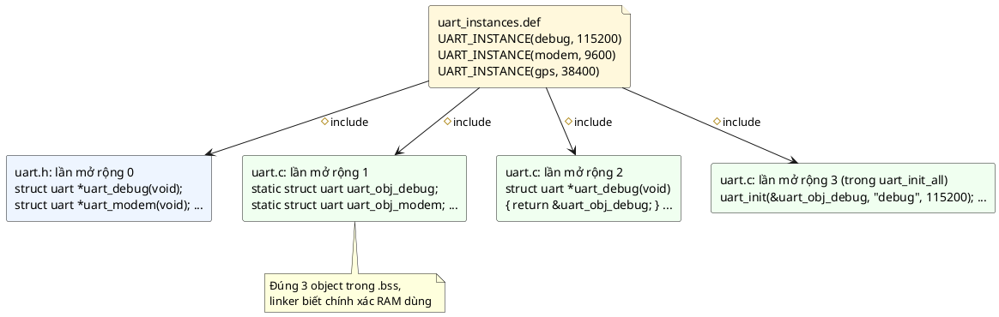

**Bước 4:** dùng trong `main.c`:

```c
#include "uart.h"

#include <string.h>

int main(void)
{
	uart_init_all();

	uart_write(uart_gps(), (const uint8_t *)"$GPGGA", strlen("$GPGGA"));
	uart_flush(uart_gps());
	uart_write(uart_debug(), (const uint8_t *)"boot ok", strlen("boot ok"));
	uart_flush(uart_debug());
	return 0;
}
```

🔬 Output thật:

```
[gps @ 38400] $GPGGA
[debug @ 115200] boot ok
```

Thấy được gì:
- Struct vẫn **opaque**: `main.c` chỉ có con trỏ.
- **Không có `malloc`, không có pool, không có `NULL` cần kiểm tra**: object luôn tồn tại.
- Thêm UART thứ tư = thêm **một dòng** vào `uart_instances.def`. Mọi thứ còn lại tự sinh.
- Gõ nhầm `uart_gsp()` thì **linker báo lỗi lúc build**, không phải crash lúc chạy.

📖 Đó là lý do sách khuyên **tự động hóa cấp phát lúc compile**.

### 10.5. So sánh và cách chọn

| | Stack (`alloca`) | Heap (`new`/`free`) | Pool tĩnh | Sinh code |
|---|---|---|---|---|
| Bộ nhớ biết lúc build? | Không | Không | **Có** | **Có** |
| Phân mảnh? | Không | **Có** | Không | Không |
| Thời gian sống | Tới khi hàm return | Tới khi `free` | Tới khi `put` | Suốt chương trình |
| Có thể thất bại lúc chạy? | Tràn stack (không báo) | `NULL` | `NULL` | **Không** |
| Số instance | Tùy ý | Tùy ý (tới khi hết heap) | Tối đa `POOL_SIZE` | Đúng số trong danh sách |
| Lỗi dễ gặp | Tràn stack, trả con trỏ ra ngoài | Rò rỉ, use-after-free | Hết slot, quên `put` | Ít |
| Hợp với | Object tạm trong một hàm | Cấp phát một lần lúc khởi động | Số instance thay đổi nhưng có trần | **Firmware production** |

📖 Sách khuyên: **dùng stack bất cứ khi nào có thể**, vì nó nhẹ nhất và hoạt động y như Object Pattern.

💡 Cách chọn nhanh:

```plantuml
@startuml
set separator none
skinparam defaultFontName Segoe UI
start
:Cần tạo một object opaque;
if (Số instance biết trước lúc build?) then (có)
  if (Có công cụ sinh code\n(X-macro, device tree)?) then (có)
    :Sinh code lúc build; <<#D0FFD0>>
  else (không)
    :Pool tĩnh; <<#D0FFD0>>
  endif
else (không)
  if (Object nhỏ và chỉ sống\ntrong một hàm?) then (có)
    :Stack (alloca); <<#D0E8FF>>
  else (không)
    :Heap (new/free)\nchỉ cấp phát lúc khởi động; <<#FFE0E0>>
  endif
endif
stop
@enduml
```

---

# Phần C — Đọc code

## 11. Đọc code mẫu từng dòng

### 11.1. Header public: [inc/uart.h](inc/uart.h)

```c
#ifndef UART_H
#define UART_H
```
Include guard (đã học ở bài 1): file có bị include hai lần thì nội dung cũng chỉ xuất hiện một lần.

```c
#include <stddef.h>
#include <stdint.h>
```
Header chỉ include **đúng thứ API cần**: `size_t` (từ `<stddef.h>`) và `uint8_t`, `uint32_t` (từ `<stdint.h>`). So với bài 1, không còn hằng `UART_TX_BUF_SIZE`, và tuyệt đối không có header vendor.

```c
struct uart;
```
Toàn bộ thông tin về struct mà người dùng nhận được chỉ có dòng này.

```c
size_t uart_size(void);
```
Cho kiểu cấp phát stack. Chú ý `(void)`: trong C, `size_t uart_size();` (không có `void`) nghĩa là "nhận số tham số **bất kỳ**", nên compiler không kiểm tra được lời gọi sai. Viết `(void)` mới là "không nhận tham số". 💡 Code mẫu trong sách viết `opaque_new()` không có `void`. Mình sửa lại cho đúng chuẩn.

```c
struct uart *uart_new(void);
void uart_free(struct uart **self);
```
Cho kiểu cấp phát heap. `uart_free` trả `void`: giải phóng thì không có gì để thất bại.

```c
struct uart *uart_pool_get(void);
void uart_pool_put(struct uart **self);
```
Cho kiểu cấp phát pool. Cùng hình dạng với cặp heap, để caller đổi qua lại dễ dàng.

💡 **Driver thật thường chỉ chọn một cách.** Code mẫu làm cả ba để so sánh.

```c
int uart_init(struct uart *self, const char *name, uint32_t baudrate);
int uart_deinit(struct uart *self);
int uart_write(struct uart *self, const uint8_t *data, size_t len);
int uart_flush(struct uart *self);
```
Y hệt bài 1. Opaque chỉ thay đổi cách **cấp phát** và **nhìn thấy**, không thay đổi cách **dùng**.

```c
size_t uart_tx_pending(const struct uart *self);
```
Getter mới. Ở bài 1, test đọc thẳng `u.tx_len`. Giờ không đọc được nữa, nên module phải chủ động quyết định **thông tin nào được phép lộ ra**. Chú ý `const`: hàm hứa không sửa object.

### 11.2. Header private: [src/uart_hw.h](src/uart_hw.h)

```c
#define UART_HW_CLOCK_HZ 16000000u

struct uart_hw_regs {
	volatile uint32_t BRR; /* Hệ số chia baud rate */
	volatile uint32_t DR;  /* Thanh ghi dữ liệu */
};
```

- Header này mô phỏng header của vendor. Nó nằm trong `src/`, **không nằm trong `inc/`**. Makefile chỉ có cờ `-Iinc`, nên `main.c` có muốn `#include "uart_hw.h"` cũng không tìm thấy file. Hàng rào dependency được giữ bằng chính cấu trúc thư mục.
- `uart.c` vẫn include được vì `#include "..."` tìm trong **cùng thư mục với file đang dịch** trước tiên.
- `16000000u`: hậu tố `u` cho biết đây là số không dấu, tránh phép chia lẫn có dấu và không dấu.
- 💡 `volatile` báo cho compiler biết giá trị có thể bị **phần cứng** thay đổi bất cứ lúc nào, nên compiler không được tối ưu bỏ các lần đọc/ghi. Thanh ghi peripheral luôn phải `volatile`. (Sẽ có bài deep-dive riêng về `volatile`.)

### 11.3. Implementation: [src/uart.c](src/uart.c)

**Phần include và hằng nội bộ:**

```c
#include "uart.h"
#include "uart_hw.h"
```
`uart.h` được include **đầu tiên**. 💡 Đây là thói quen tốt: nếu `uart.h` quên include thứ nó cần (ví dụ `<stdint.h>`), lỗi sẽ lộ ra ngay khi dịch `uart.c`, thay vì lộ ra ở file của người khác.

```c
#define UART_TX_BUF_SIZE 32

#ifndef UART_POOL_SIZE
#define UART_POOL_SIZE 2
#endif
```
- `UART_TX_BUF_SIZE` giờ là chi tiết nội bộ. Đổi thành 64 chỉ cần build lại `uart.c`.
- `#ifndef UART_POOL_SIZE` cho phép đổi kích thước pool từ ngoài bằng cờ build `-DUART_POOL_SIZE=4`, không phải sửa code.

**Định nghĩa struct:**

```c
struct uart {
	const char *name;
	uint32_t baudrate;
	struct uart_hw_regs regs; /* Kiểu từ header vendor, không lọt ra uart.h */
	uint8_t tx_buf[UART_TX_BUF_SIZE];
	size_t tx_len;
};
```
Đây là định nghĩa **duy nhất** của `struct uart` trong cả project. Từ dòng này trở xuống, `struct uart` là complete type trong file `uart.c`.

💡 Trên PC, `regs` là một struct nằm ngay trong object để mô phỏng. Trên chip thật, đây sẽ là **con trỏ** tới địa chỉ cố định của peripheral, ví dụ `volatile struct uart_hw_regs *regs`, được gán trong `uart_init` bằng địa chỉ như `0x40011000`.

**`uart_size`:**

```c
size_t uart_size(void)
{
	return sizeof(struct uart);
}
```
`sizeof` được tính **lúc compile `uart.c`**, thành hằng số 64 nhúng vào mã máy. Hàm này chỉ trả hằng số đó ra cho người ngoài.

**`uart_new`:**

```c
struct uart *uart_new(void)
{
	return malloc(sizeof(struct uart));
}
```
- Trả thẳng kết quả của `malloc`, có thể là `NULL`. **Caller phải kiểm tra.**
- Không `memset`, không khởi tạo gì: đó là việc của `uart_init` (xem mục 13).
- 💡 Không cần ép kiểu `(struct uart *)malloc(...)`: trong C, `void *` tự chuyển sang mọi kiểu con trỏ đối tượng. (Trong C++ thì phải ép.)

**`uart_free`:**

```c
void uart_free(struct uart **self)
{
	if (!self) {
		return;
	}

	free(*self);
	*self = NULL;
}
```
- `if (!self)`: kiểm tra **con trỏ cấp hai** khác `NULL`, tức caller không truyền `uart_free(NULL)`.
- Không cần kiểm tra `*self` khác `NULL`: chuẩn C bảo đảm `free(NULL)` không làm gì. Nhờ vậy gọi `uart_free(&uart)` hai lần cũng an toàn: lần hai `*self` đã là `NULL`.
- `*self = NULL`: ghi vào biến của caller (mục 10.2).

**Pool:** đã giải thích ở mục 10.3. Thêm hai chi tiết:
- `&uart_pool[i] == *self`: so sánh **bằng nhau** giữa hai con trỏ là hợp lệ với mọi con trỏ. 💡 Nếu dùng phép trừ `*self - uart_pool` để tính chỉ số, thì khi `*self` không thuộc mảng (ví dụ con trỏ từ heap truyền nhầm vào), phép trừ là undefined behavior. Vòng lặp so sánh bằng an toàn hơn.
- Con trỏ không thuộc pool thì vòng lặp không tìm thấy, không đánh dấu gì, nhưng vẫn đặt `*self = NULL`. 💡 Một phương án chặt chẽ hơn là trả mã lỗi trong trường hợp này (Bài tập gợi ý ở mục 23).

**`uart_init`:**

```c
int uart_init(struct uart *self, const char *name, uint32_t baudrate)
{
	if (!self || !name || baudrate == 0) {
		return -EINVAL;
	}

	memset(self, 0, sizeof(*self));
	self->name = name;
	self->baudrate = baudrate;
	self->regs.BRR = UART_HW_CLOCK_HZ / baudrate;
	return 0;
}
```
- Kiểm tra `baudrate == 0` **trước** khi chia: chia cho 0 trên Cortex-M có thể gây fault (nếu bật bẫy chia 0) hoặc cho kết quả 0.
- `memset` xóa sạch, vì object từ `alloca` hay `malloc` đều chứa rác. Object từ pool thì có thể chứa dữ liệu của lần dùng trước.
- `UART_HW_CLOCK_HZ / baudrate`: 16 000 000 / 115 200 = 138,8, phép chia số nguyên cắt phần lẻ thành **138**. 💡 Driver thật thường làm tròn: `(clock + baud / 2) / baud` = 139, sai số baud nhỏ hơn.

**`uart_deinit`, `uart_write`, `uart_flush`:** giống bài 1 (xem [bài giảng 01, mục 5](../01_ObjectPattern/LECTURE.md#5-đọc-code-mẫu-từng-phần)). `uart_flush` in thêm `BRR` để thấy giá trị thanh ghi.

**`uart_tx_pending`:**

```c
size_t uart_tx_pending(const struct uart *self)
{
	return self ? self->tx_len : 0;
}
```
Trả `0` khi `self` là `NULL`. 💡 Đây là một quyết định gây tranh cãi, xem mục 13.

### 11.4. Demo: [main.c](main.c)

```c
#include "uart.h"
```
`main.c` chỉ include `uart.h`. Không có `uart_hw.h`, không biết struct có field gì.

```c
#ifdef _WIN32
#include <malloc.h>
#else
#include <alloca.h>
#endif
```
`_WIN32` là macro do compiler tự định nghĩa khi build cho Windows. Đây là cách viết code chạy được trên nhiều nền tảng.

```c
static void demo_stack(void)
{
	struct uart *uart = alloca(uart_size());
	...
}
```
Ba hàm demo đều là `static`: chúng chỉ dùng trong `main.c`. 💡 Hàm `static` khác biến `static`: hàm `static` chỉ giới hạn **phạm vi tên** (không lộ ra ngoài file), không chứa state nào. Bài 1 chỉ cấm **biến** `static` mang state.

---

## 12. Theo dõi demo chạy từng bước

Output đầy đủ của `make run`:

```
sizeof(struct uart) = 64 bytes (main.c only knows it via uart_size())
pending before flush: 10 bytes
[UART0 @ 115200, BRR=138] from stack
[UART1 @ 9600, BRR=1666] from heap
after uart_free: uart is NULL
pool: a=ok b=ok c=NULL
[UART2 @ 57600, BRR=277] from pool
after put: c=ok
```

Dưới đây là trạng thái bộ nhớ sau từng lệnh.

### `main()`

| # | Lệnh | Kết quả |
|---|---|---|
| 1 | `uart_size()` | Trả 64. In dòng `sizeof(struct uart) = 64 bytes` |

### `demo_stack()`

| # | Lệnh | Trạng thái sau lệnh |
|---|---|---|
| 1 | `alloca(uart_size())` | SP lùi 64 byte. `uart` = địa chỉ trên stack. Nội dung: rác |
| 2 | `uart_init(uart, "UART0", 115200)` | `name="UART0"`, `baudrate=115200`, `BRR=138`, `tx_len=0` |
| 3 | `write_str(uart, "from stack")` | 10 byte vào `tx_buf`, `tx_len=10` |
| 4 | `uart_tx_pending(uart)` | Trả 10. In `pending before flush: 10 bytes` |
| 5 | `uart_flush(uart)` | In `[UART0 @ 115200, BRR=138] from stack`, `tx_len=0` |
| 6 | `uart_deinit(uart)` | Cả 64 byte về 0 |
| 7 | (hàm return) | SP về chỗ cũ, 64 byte được thu hồi |

### `demo_heap()`

| # | Lệnh | Trạng thái sau lệnh |
|---|---|---|
| 1 | `uart_new()` | `malloc(64)` thành công, `uart` = địa chỉ heap. Nội dung: rác |
| 2 | `uart_init(uart, "UART1", 9600)` | `BRR` = 16 000 000 / 9 600 = **1666** |
| 3 | `write_str(uart, "from heap")` | `tx_len=9` |
| 4 | `uart_flush(uart)` | In `[UART1 @ 9600, BRR=1666] from heap` |
| 5 | `uart_deinit(uart)` | 64 byte về 0 |
| 6 | `uart_free(&uart)` | Khối heap được trả lại, **`uart = NULL`**. In `uart is NULL` |

### `demo_pool()`

Ban đầu `uart_pool_used = [false, false]`.

| # | Lệnh | `uart_pool_used` | Biến |
|---|---|---|---|
| 1 | `a = uart_pool_get()` | `[true, false]` | `a = &uart_pool[0]` |
| 2 | `b = uart_pool_get()` | `[true, true]` | `b = &uart_pool[1]` |
| 3 | `c = uart_pool_get()` | `[true, true]` | `c = NULL` (hết slot) |
| 4 | `printf(...)` | | In `pool: a=ok b=ok c=NULL` |
| 5 | `uart_init(a, "UART2", 57600)` | | `BRR` = 16 000 000 / 57 600 = **277** |
| 6 | `write_str` + `uart_flush(a)` | | In `[UART2 @ 57600, BRR=277] from pool` |
| 7 | `uart_deinit(a)` | | `uart_pool[0]` về 0 |
| 8 | `uart_pool_put(&a)` | `[false, true]` | `a = NULL` |
| 9 | `c = uart_pool_get()` | `[true, true]` | `c = &uart_pool[0]`. In `after put: c=ok` |
| 10 | `uart_pool_put(&b)` | `[true, false]` | `b = NULL` |
| 11 | `uart_pool_put(&c)` | `[false, false]` | `c = NULL`. Pool trở lại trạng thái ban đầu |

💡 Chú ý bước 9: `c` nhận **đúng slot cũ của `a`**. Nếu ở đâu đó còn giữ bản copy của con trỏ `a` cũ, thì bản copy đó giờ trỏ vào object của `c`. Đây là phiên bản pool của lỗi use-after-free (mục 18).

---

## 13. Các quyết định thiết kế và phương án khác

### `uart_new` chỉ cấp phát, không khởi tạo

Code mẫu của sách cũng tách `opaque_new()` và `opaque_init()`. Lý do:
- `uart_init` dùng chung cho **cả ba** cách cấp phát. Gộp vào `new` thì phải viết lại logic init cho stack và pool.
- Caller có thể `deinit` rồi `init` lại cùng một object (ví dụ đổi baud rate) mà không cần cấp phát lại.

💡 Phương án khác: `struct uart *uart_create(const char *name, uint32_t baudrate)` gộp cả hai. Tiện hơn cho caller, nhưng chỉ hợp khi module chỉ hỗ trợ **một** cách cấp phát.

### Hàm giải phóng nhận `**self`

Đã giải thích ở mục 10.2. Phương án khác là nhận `*self` (như `free()` chuẩn), để caller tự đặt `NULL`. Ngắn hơn nhưng dễ quên. Sách chọn `**`.

### Getter trả `0` khi `self` là `NULL`

```c
size_t uart_tx_pending(const struct uart *self)
{
	return self ? self->tx_len : 0;
}
```

Vấn đề: `0` vừa có nghĩa "buffer rỗng" vừa có nghĩa "bạn truyền `NULL`". Caller **không phân biệt được** hai trường hợp. Có ba phương án:

| Phương án | Ví dụ | Ưu | Nhược |
|---|---|---|---|
| Trả giá trị "an toàn" | Code mẫu: trả `0` | Đơn giản | Che giấu lỗi của caller |
| `assert(self)` | Dừng ngay khi debug | Bắt lỗi lập trình sớm | Build release thường tắt `assert` |
| Trả mã lỗi, dữ liệu qua con trỏ | `int uart_tx_pending(const struct uart *self, size_t *out);` | Phân biệt rõ lỗi và dữ liệu | Gọi dài hơn |

Phương án 3 chính là quy ước của **bài 9 (Return Value Pattern)**. Code mẫu chọn phương án 1 cho gọn, nhưng bạn nên biết cái giá của nó.

### Pool tìm kiếm tuyến tính

`uart_pool_get` duyệt từ đầu mảng, mất thời gian tỉ lệ với `UART_POOL_SIZE`. Với 2–8 phần tử thì không đáng kể. 💡 Pool lớn (hàng trăm phần tử, ví dụ pool cho gói tin mạng) thường dùng **free list**: mỗi slot trống lưu chỉ số của slot trống tiếp theo, nên `get` và `put` đều chỉ mất một bước.

### Không `typedef` struct

Code mẫu viết `struct uart *` thay vì đặt `typedef struct uart uart_t;`. Sách và Linux kernel đều theo cách này: chữ `struct` cho người đọc biết ngay đây là một struct. Xem thêm FAQ ở mục 20.

### Handle có kiểu thay vì `void *`

Một số thư viện dùng `void *` làm handle chung cho mọi loại thiết bị. 📖 Phần giới thiệu sách nhấn mạnh việc làm API *"type safe"*, *"không dùng các thực hành không an toàn như con trỏ `void`"*. 🔬 Thí nghiệm cho thấy vì sao:

```c
struct uart;
struct spi;

void uart_flush(struct uart *self);   /* handle có kiểu */
void dev_flush(void *handle);         /* handle kiểu void * */

void caller(struct spi *spi)
{
	dev_flush(spi);    /* nhầm SPI thành UART: compiler im lặng */
	uart_flush(spi);   /* nhầm SPI thành UART: compiler bắt được */
}
```

Output của gcc:

```
handle_types.c:10:20: error: passing argument 1 of 'uart_flush' from incompatible pointer type [-Wincompatible-pointer-types]
   10 |         uart_flush(spi);   /* nhầm SPI thành UART: compiler bắt được */
      |                    ^~~
      |                    |
      |                    struct spi *
handle_types.c:4:30: note: expected 'struct uart *' but argument is of type 'struct spi *'
```

Dòng `dev_flush(spi)` **không có thông báo nào**: mọi con trỏ đều chuyển ngầm sang `void *`. Opaque Pattern dùng `struct uart *` nên giấu được nội dung mà **vẫn giữ kiểm tra kiểu**.

---

# Phần D — Thực tế và tổng kết

## 14. Opaque Pattern trong thực tế

### Zephyr RTOS

📖 Sách: *"Zephyr dùng opaque object cho mọi device. Nhờ vậy chi tiết implementation, ví dụ của STM32, được giữ hoàn toàn private, không xung đột với các file include khác, và ứng dụng không truy cập được vì chúng không thuộc interface public của SDK."*

Ví dụ ở mục 10.4: `struct pwm_stm32_data` chỉ được định nghĩa trong file driver. Ứng dụng chỉ cầm `const struct device *` và gọi API chung.

### 💡 Đối chiếu: STM32 HAL **không** opaque

`UART_HandleTypeDef` được định nghĩa đầy đủ trong header, nên ứng dụng sửa được `huart2.gState` hay `huart2.Init.BaudRate` trực tiếp. Đây là Object Pattern (bài 1) chứ không phải Opaque. Đổi lại, bạn khai báo được `UART_HandleTypeDef huart2;` như biến thường mà không cần cơ chế cấp phát nào.

### 💡 FreeRTOS: opaque handle + "struct giả" cho cấp phát tĩnh

- `TaskHandle_t` là con trỏ tới `struct tskTaskControlBlock`, một struct chỉ được định nghĩa trong `tasks.c`. Đó là opaque handle.
- `xTaskCreate()` cấp phát trên heap (kiểu 2).
- `xTaskCreateStatic()` cho phép caller tự cấp phát. Để làm được điều đó mà vẫn giấu field, FreeRTOS công khai một kiểu `StaticTask_t` có **cùng kích thước và căn lề** với struct thật, nhưng các field đều mang tên vô nghĩa (dummy). Caller khai báo được biến tĩnh, nhưng không đọc được gì có ý nghĩa bên trong.

Đây là cách thứ 5 để giải bài toán cấp phát, sách không đề cập. Bạn sẽ tự làm thử trong Bài tập 3.

### 💡 Thư viện chuẩn C: `FILE *`

`fopen()` trả về `FILE *`, sau đó bạn dùng `fread`, `fwrite`, `fclose`. Bạn gần như không bao giờ đụng vào field của `FILE`. Đây là ví dụ opaque handle quen thuộc nhất, với cặp `new`/`free` mang tên `fopen`/`fclose`.

### 💡 AUTOSAR

Nếu bạn làm AUTOSAR Classic: các module BSW giao tiếp qua API chuẩn hóa, còn cấu trúc dữ liệu nội bộ của module do tool cấu hình (như DaVinci Configurator) **sinh ra lúc build**. Đó chính là tinh thần "cấp phát tĩnh bằng sinh code" của mục 10.4, ở quy mô lớn hơn nhiều.

---

## 15. Unit test với object bị giấu

📖 Chương Object của sách liệt kê một lợi ích là test có thể **nhìn vào bên trong object**. Opaque lấy mất lợi ích đó. Có hai cách test:

### Cách 1: Black-box, chỉ qua API public (khuyên dùng)

```c
#include <assert.h>
#include <errno.h>
#include "uart.h"

static void test_write_then_flush(void)
{
	struct uart *u = uart_new();
	assert(u != NULL);
	assert(uart_init(u, "T", 9600) == 0);
	assert(uart_write(u, (const uint8_t *)"abc", 3) == 0);
	assert(uart_tx_pending(u) == 3);   /* đi qua getter, không đọc field */
	assert(uart_flush(u) == 0);
	assert(uart_tx_pending(u) == 0);
	uart_deinit(u);
	uart_free(&u);
	assert(u == NULL);
}

static void test_pool_exhaustion(void)
{
	struct uart *a = uart_pool_get();
	struct uart *b = uart_pool_get();
	assert(a && b && a != b);
	assert(uart_pool_get() == NULL);   /* pool 2 phần tử đã hết */
	uart_pool_put(&a);
	assert(a == NULL);
	a = uart_pool_get();
	assert(a != NULL);                 /* slot được tái sử dụng */
	uart_pool_put(&a);
	uart_pool_put(&b);
}

int main(void)
{
	test_write_then_flush();
	test_pool_exhaustion();
	return 0;
}
```

Build: `gcc -std=c99 -Wall -Wextra -Werror -pedantic -Iinc test_blackbox.c src/uart.c`

Ưu điểm: test **chỉ dựa vào hợp đồng public**. Đổi cấu trúc bên trong, ví dụ đổi buffer thẳng thành ring buffer, thì test vẫn chạy.

💡 Chú ý: pool là state chung của cả module, nên test dùng pool phải **trả hết slot** khi xong. Nếu không, test sau sẽ bị ảnh hưởng. Đây chính là vấn đề "state sót lại" của biến `static` mà bài 1 đã nói.

### Cách 2: White-box, include thẳng file `.c`

```c
#include <assert.h>
#include "uart.c"   /* white-box: nhìn thấy định nghĩa struct, build với -Isrc */

int main(void)
{
	struct uart u;                     /* được phép vì struct đã hoàn chỉnh */
	assert(uart_init(&u, "T", 9600) == 0);
	assert(u.regs.BRR == UART_HW_CLOCK_HZ / 9600);
	return 0;
}
```

Build: `gcc -std=c99 -Wall -Wextra -Werror -pedantic -Iinc -Isrc test_whitebox.c` (không link thêm `uart.c`, vì nó đã được include).

Tại sao chạy được? Theo mục 2: `#include "uart.c"` dán toàn bộ `uart.c` vào translation unit của file test, nên file test thấy định nghĩa struct.

Dùng khi cần kiểm tra chi tiết nội bộ mà API không lộ ra, như giá trị thanh ghi. Nhược điểm: test bị **gắn chặt vào implementation**, đổi tên field là test phải sửa theo.

🔬 Cả hai đoạn test trên đã được build và chạy thật, đều qua.

---

## 16. Trade-off

| Tiêu chí | Object (bài 1) | Opaque (bài 2) |
|---|---|---|
| **Đóng gói** | Quy ước, compiler không ép | **Compiler ép** |
| **Dependency qua header** | Rò rỉ ra mọi file include | **Bị chặn tại `.c`** |
| **Cấp phát** | Caller tự lo, rất đơn giản | **Phải có cơ chế cấp phát** (📖 nhược điểm chính) |
| **Lồng object vào struct khác** | Được (`struct app { struct uart uart; }`) | **Không được** (📖 nhược điểm thứ hai) |
| **RAM** | Đúng bằng struct | Heap tốn thêm metadata cho mỗi khối; pool phải dành sẵn tối đa |
| **Tốc độ** | Truy cập field trực tiếp | 💡 Getter là lời gọi hàm thật, compiler không inline qua file `.c` khác (trừ khi bật LTO) |
| **Thời gian build** | Sửa struct thì build lại mọi file include | **Sửa struct chỉ build lại `uart.c`** |
| **Test** | Đọc field thoải mái | Qua getter, hoặc white-box include `.c` |
| **Kiểm tra kiểu** | Có | Có (vẫn là `struct uart *`, không phải `void *`) |

📖 Về nhược điểm "không lồng được": sách giải thích rằng với Object Pattern, ta thường tổ chức dữ liệu thành **một cây phân cấp gọn gàng**, với struct `application` ở gốc chứa mọi object con. Opaque không cho khai báo object trực tiếp, nên **phá vỡ cây phân cấp đó**. Struct cha chỉ còn giữ được con trỏ:

```c
struct application {
	struct uart *debug_uart;   /* chỉ là con trỏ, object thật nằm ở heap/pool */
	struct led status_led;     /* led vẫn là Object Pattern nên lồng được */
};
```

💡 **LTO là gì?** *Link Time Optimization* (cờ `-flto`): compiler giữ lại thông tin trung gian trong file `.o`, để lúc link có thể tối ưu xuyên file, kể cả inline `uart_tx_pending` vào `main.c`. Nhờ vậy getter gần như không tốn gì, mà struct vẫn opaque ở mức source code.

---

## 17. Khi nào không nên dùng

📖 Sách đưa **Object Pattern** làm lựa chọn thay thế, *"đơn giản hơn một chút, nếu bạn chấp nhận để lộ mọi dependency cho code include header của mình"*.

💡 Tóm lại, chọn **Object** khi:
- Struct chỉ dùng kiểu chuẩn (`uint8_t`, `size_t`, ...), không có header vendor nào cần giấu.
- Module nội bộ, chỉ vài file trong cùng team dùng.
- Bạn muốn object lồng thẳng vào struct cha để giữ cây dữ liệu gọn và cấp phát tĩnh đơn giản.
- Có getter rất nóng (gọi trong ISR hàng chục nghìn lần mỗi giây) và không bật được LTO.

Chọn **Opaque** khi:
- Struct chứa kiểu của vendor/HAL/thư viện ngoài, tức là cần **hàng rào dependency**.
- Module là thư viện/SDK cho người khác dùng, và bạn muốn tự do đổi cấu trúc bên trong mà không làm hỏng code của họ (giữ nguyên **ABI**: code đã compile sẵn của họ vẫn chạy với bản thư viện mới).
- Dữ liệu nhạy cảm, không được để code bên ngoài sửa bậy (state machine, bộ đếm an toàn).

📖 Hai lựa chọn khác sách nhắc:
- **Singleton** (bài 3): giống Opaque, nhưng *"thậm chí không truyền con trỏ context đi"*. Chỉ dùng cho subsystem toàn cục như logging hay network stack. 📖 Ngay cả singleton cũng nên dùng Object Pattern ở bên trong.
- **Abstract API / Virtual API** (bài 7): một interface trừu tượng **tự nó đã là opaque**. Struct chỉ chứa con trỏ hàm, và mỗi hàm lấy lại dữ liệu riêng bằng macro `CONTAINER_OF`. Cách này nặng hơn Opaque đơn giản.

---

## 18. Lỗi hay gặp

| Lỗi | Hậu quả | Cách tránh |
|---|---|---|
| 📖 Object lớn cấp phát bằng `alloca` | **Tràn stack**, crash không báo trước | Biết kích thước stack của task; object lớn thì dùng pool |
| 📖 `malloc`/`free` liên tục lúc chạy | **Phân mảnh heap**, `malloc` thất bại sau nhiều ngày chạy | Chỉ cấp phát lúc khởi động, hoặc bỏ hẳn heap |
| Không kiểm tra `NULL` sau `uart_new()` / `uart_pool_get()` | Ghi vào địa chỉ 0, HardFault | 📖 *"Always check for failed allocations"* |
| Quên gọi `uart_free` | Rò rỉ bộ nhớ, heap cạn dần | Mỗi `new` phải có đúng một `free`, nên đặt trong cùng một hàm hoặc cặp init/deinit |
| Có **nhiều bản copy** của con trỏ | `uart_free(&a)` chỉ đặt `a = NULL`, bản copy `b` vẫn treo | Chỉ để một nơi "sở hữu" object; nơi khác mượn và không giữ lâu |
| Giữ con trỏ cũ sau `pool_put` | Slot được cấp cho người khác (mục 12, bước 9), hai bên ghi đè nhau | Như trên |
| Trộn cách cấp phát (`uart_free` cho object lấy từ pool hoặc `alloca`) | `free()` một địa chỉ không thuộc heap, crash | Mỗi object chỉ trả về đúng nơi đã cấp ra |
| Trả con trỏ `alloca` ra khỏi hàm | Con trỏ treo; compiler chỉ cảnh báo khi bật `-O2` | Object cần sống lâu hơn hàm thì không dùng `alloca` |
| Dùng mảng `uint8_t` thay `alloca` | Sai căn lề, UsageFault trên Cortex-M | Dùng `alloca`, hoặc kỹ thuật `StaticTask_t` có căn lề đúng |
| Quên `uart_init` sau `uart_new` | `malloc` trả bộ nhớ rác | `new` chỉ cấp phát, **luôn** gọi `init` ngay sau |
| Thêm getter/setter cho **mọi** field | Thực chất là struct public đội lốt, mất hết ý nghĩa giấu | Chỉ lộ những gì caller thật sự cần; ưu tiên hàm hành vi (`uart_write`) hơn setter |
| Gọi pool từ nhiều thread hoặc từ ISR | Hai bên cùng lấy được một slot | Bảo vệ bằng lock (bài 11–13) hoặc chỉ cấp phát lúc khởi động |
| Đặt header private vào `inc/` | Hàng rào dependency bị thủng, ai cũng include được | Header private nằm trong `src/` |

---

## 19. Quy trình refactor từ Object sang Opaque

1. **Chuyển định nghĩa struct** từ `uart.h` sang `uart.c`. Trong `uart.h` chỉ để lại `struct uart;`.
2. **Chuyển các `#include` chỉ struct cần** (header vendor, hằng nội bộ) từ `uart.h` sang `uart.c`.
3. **Build lại.** Compiler sẽ báo lỗi ở **mọi chỗ** bên ngoài đang đọc/ghi field hoặc khai báo `struct uart x;`. Đây là danh sách việc cần làm, compiler lập giúp bạn.
4. Với mỗi chỗ **đọc/ghi field**: hỏi xem caller thật sự cần gì, rồi thêm một hàm hành vi hoặc getter phù hợp. Đừng thêm setter một cách máy móc.
5. Với mỗi chỗ **khai báo object**: chọn cách cấp phát theo sơ đồ ở mục 10.5, và thêm `uart_size()` / `uart_pool_get()` / `uart_new()` / X-macro.
6. **Thêm cặp giải phóng** (`free`/`put`) dạng `struct uart **self`, có đặt `NULL`.
7. Struct cha nào đang lồng `struct uart` thì đổi thành `struct uart *`.
8. **Viết lại test** theo kiểu black-box qua API public.
9. Kiểm tra lại bằng `gcc -E main.c | grep <tên field>`: không còn field nào lọt ra ngoài.

---

## 20. Câu hỏi thường gặp (FAQ)

**Hỏi: Có nên viết `typedef struct uart uart_t;` cho gọn không?**

Được, nhưng sách và Linux kernel giữ `struct uart` vì chữ `struct` cho biết ngay đây là struct. 💡 Điều nên **tránh** là typedef **cả con trỏ**: `typedef struct uart *uart_handle_t;`. Khi đó `const uart_handle_t h` nghĩa là *con trỏ hằng tới object không hằng*, ngược với điều người đọc thường nghĩ, và nhìn code không thấy dấu `*` nên dễ quên đây là con trỏ.

**Hỏi: Opaque có bảo vệ bộ nhớ lúc chạy không?**

Không. Opaque chỉ giấu ở mức **compile**. Lúc chạy, object vẫn là các byte bình thường trong RAM. Một con trỏ hoang hay `memset` nhầm vẫn ghi đè được nó. Debugger cũng vẫn thấy mọi field, vì đọc thông tin debug trong `uart.o`. Opaque là công cụ **tổ chức code**, không phải công cụ bảo mật.

**Hỏi: Hai file `.c` có thể định nghĩa `struct uart` khác nhau không?**

Về cú pháp, compiler cho phép, vì mỗi translation unit tự định nghĩa kiểu của riêng nó. Nhưng nếu một object được tạo theo định nghĩa này rồi bị đọc theo định nghĩa kia, kết quả là undefined behavior. Quy tắc: **mỗi struct chỉ được định nghĩa ở đúng một chỗ.**

**Hỏi: Caller có `uart_size()`, vậy có tự `memcpy` object được không?**

Về kỹ thuật thì được, nhưng đừng. Copy object là copy cả các con trỏ bên trong. Hai object cùng trỏ vào một tài nguyên (thanh ghi, buffer ngoài) sẽ dẫn tới lỗi khó lường. Nếu cần copy, module nên cung cấp hàm `uart_clone()` và tự quyết định copy thế nào.

**Hỏi: Getter có làm firmware chậm không?**

Mỗi lần gọi tốn vài chu kỳ cho lệnh gọi hàm và return. Với đa số trường hợp không đáng kể. Với code cực nóng: bật LTO (mục 16), hoặc cân nhắc dùng Object Pattern cho module đó.

**Hỏi: Header public có cần include `<stdint.h>` không?**

Có, nếu API dùng `uint8_t`, `uint32_t`. Nguyên tắc: header phải **tự đủ** (self-contained), tức là include riêng nó cũng compile được, và chỉ include đúng thứ API cần, không hơn.

**Hỏi: Opaque có dùng được cho singleton không?**

Đó chính là bài 3. Singleton là trường hợp đặc biệt khi chỉ có đúng một instance, và theo sách thì thậm chí không truyền con trỏ ra ngoài.

---

## 21. Tóm tắt và checklist

**Một câu:** *Struct định nghĩa trong `.c`, header chỉ khai báo, caller chỉ cầm con trỏ, module tự lo cấp phát.*

**Vì sao nó chạy được:** mỗi file `.c` là một translation unit riêng; định nghĩa struct chỉ nằm trong translation unit của `uart.c`; bên ngoài nó là incomplete type, nên compiler không biết offset và kích thước, chỉ xử lý được con trỏ.

Checklist cho mỗi module opaque:

- [ ] Header chỉ có `struct <module>;`, không có định nghĩa
- [ ] Header tự đủ, chỉ include thứ API thật sự cần (`<stdint.h>`, `<stddef.h>`, ...)
- [ ] Header vendor và hằng nội bộ nằm trong `.c` hoặc header private trong `src/`
- [ ] Bên trong vẫn là Object Pattern: mọi hàm nhận `self`, có `init`/`deinit`
- [ ] Có ít nhất một cách cấp phát: `<module>_size()`, `<module>_new()`/`_free()`, pool, hoặc sinh code
- [ ] Hàm giải phóng nhận `struct <module> **self` và đặt `*self = NULL`
- [ ] Caller luôn kiểm tra `NULL` sau khi cấp phát
- [ ] `new` chỉ cấp phát, `init` mới khởi tạo
- [ ] Getter chỉ lộ thông tin caller cần, dùng `const struct <module> *self`
- [ ] Hàm không tham số khai báo `(void)`
- [ ] Nếu dùng pool: ghi rõ chưa thread-safe, hoặc đã có lock

---

## 22. Quiz (có đáp án)

Câu 1–4 là quiz gốc của sách. Câu 5–10 do Claude thêm.

**Câu 1.** 📖 Vì sao ta muốn giấu cấu trúc dữ liệu của object khỏi code bên ngoài implementation?

<details><summary>Đáp án</summary>

(1) **Cô lập dependency:** struct thường chứa kiểu dữ liệu đặc thù của implementation (header vendor/HAL). Để struct trong header thì mọi file include header đều bị kéo theo các header đó, gây build chậm, xung đột macro và trói vào một dòng chip. (2) **Ngăn truy cập trực tiếp:** code bên ngoài không đọc, sửa hay thậm chí nhìn thấy field, nên module giữ được tính đúng đắn của dữ liệu. Compiler ép quy tắc này chứ không chỉ là quy ước.
</details>

**Câu 2.** 📖 Vì sao Opaque Pattern cần một cơ chế cấp phát riêng?

<details><summary>Đáp án</summary>

Bên ngoài file `.c`, struct là **incomplete type**: compiler không biết kích thước, nên caller không thể viết `struct uart u;` hay `sizeof(struct uart)`. Implementation phải hoặc cho biết kích thước (`uart_size()` để caller dùng `alloca`), hoặc tự cấp phát (heap qua `new`/`free`, hoặc pool tĩnh / sinh code lúc build).
</details>

**Câu 3.** 📖 Opaque Pattern ảnh hưởng thế nào tới cấu trúc dữ liệu của ứng dụng?

<details><summary>Đáp án</summary>

Với Object Pattern, dữ liệu thường tổ chức thành một cây phân cấp: struct `application` ở gốc **chứa trực tiếp** các object con, tất cả cấp phát tĩnh trong một khối. Opaque không cho khai báo object trực tiếp, nên struct cha chỉ giữ được **con trỏ**, còn object thật nằm ở chỗ khác (heap, pool, stack). Cây dữ liệu bị tách rời, và ta phải tự quản lý vòng đời từng object.
</details>

**Câu 4.** 📖 Vì sao nên tự động hóa việc cấp phát object lúc compile?

<details><summary>Đáp án</summary>

Vì ta **biết chính xác lượng bộ nhớ dùng ngay lúc build**: không phân mảnh, không có nguy cơ hết heap lúc đang chạy, không có `NULL` cần kiểm tra. Đồng thời, việc tạo instance được tự động hóa từ một nguồn mô tả (device tree của Zephyr, hay file X-macro), nên số instance luôn khớp với phần cứng thật mà không phải đếm tay hay sửa nhiều chỗ.
</details>

**Câu 5.** Tại sao `uart_free` nhận `struct uart **self` thay vì `struct uart *self`?

<details><summary>Đáp án</summary>

C truyền tham số theo giá trị. Với `struct uart *`, hàm nhận bản copy của địa chỉ và chỉ đặt được **bản copy** về `NULL`; biến của caller vẫn trỏ vào vùng đã giải phóng (thí nghiệm ở mục 10.2 cho thấy `a` vẫn là `...C620`). Với `struct uart **`, hàm nhận **địa chỉ của biến** của caller, nên `*self = NULL` ghi thẳng vào biến đó. Lưu ý: cách này chỉ bảo vệ **một** biến. Các bản copy khác của con trỏ vẫn treo.
</details>

**Câu 6.** Đoạn code sau có lỗi gì?

```c
struct uart *create_debug_uart(void)
{
	struct uart *u = alloca(uart_size());
	uart_init(u, "DBG", 115200);
	return u;
}
```

<details><summary>Đáp án</summary>

`alloca` cấp phát trên stack frame của `create_debug_uart`, nên vùng nhớ **được thu hồi khi hàm return**. Con trỏ trả về là con trỏ treo, và lần gọi hàm tiếp theo sẽ ghi đè lên object. gcc chỉ cảnh báo (`-Wreturn-local-addr`) khi bật tối ưu như `-O2`. Ở `-O0` nó im lặng. Sửa: dùng `uart_new()` hoặc `uart_pool_get()`, hoặc để caller tự `alloca` trong hàm của nó.
</details>

**Câu 7.** Code mẫu có `static struct uart uart_pool[2];` trong `uart.c`. Như vậy có vi phạm quy tắc "không có biến static" của bài 1 không?

<details><summary>Đáp án</summary>

Không. Bài 1 cấm **state của object** nằm trong biến `static`, vì khi đó các instance ngầm dùng chung state. Ở đây, pool là **kho chứa**: mỗi phần tử là một object độc lập, truy cập qua `self`. Còn `uart_pool_used` là state của **bộ cấp phát**, không phải của UART nào. Tuy vậy, pool vẫn là state chung của module, nên cần lock nếu nhiều thread cùng dùng, và test phải trả hết slot sau khi chạy.
</details>

**Câu 8.** Bạn viết driver cho cảm biến nhiệt độ. Struct chỉ gồm `uint8_t i2c_addr; int16_t last_temp;` và driver chỉ dùng trong nội bộ team. Bạn chọn Object hay Opaque? Vì sao?

<details><summary>Đáp án</summary>

**Object** là hợp lý. Struct chỉ dùng kiểu chuẩn nên không có dependency nào cần giấu. Đây là module nội bộ, và Object cho phép lồng thẳng vào struct cha, cấp phát tĩnh đơn giản. Opaque sẽ thêm cơ chế cấp phát mà không mang lại lợi ích tương xứng. Nếu sau này struct cần chứa kiểu của HAL I2C, hoặc driver được phát hành thành thư viện cho team khác, thì cân nhắc chuyển sang Opaque.
</details>

**Câu 9.** Khi compile `main.c`, compiler báo `invalid use of undefined type 'struct uart'`. Nhưng `struct uart` rõ ràng **có** định nghĩa trong `uart.c`, cùng project. Vì sao compiler "không thấy"?

<details><summary>Đáp án</summary>

Vì compiler dịch **từng file `.c` riêng biệt** (mỗi file là một translation unit). Khi dịch `main.c`, nó chỉ thấy nội dung của `main.c` cộng với các header được include, tức là chỉ có dòng `struct uart;`. Định nghĩa trong `uart.c` thuộc một translation unit khác, nên compiler chưa bao giờ thấy nó lúc dịch `main.c`. Linker sau đó chỉ nối tên hàm, không mang định nghĩa kiểu sang.
</details>

**Câu 10.** Vì sao Opaque Pattern dùng `struct uart *` làm handle thay vì `void *`?

<details><summary>Đáp án</summary>

Để giữ **kiểm tra kiểu**. Mọi con trỏ đều chuyển ngầm sang `void *`, nên truyền nhầm `struct spi *` vào hàm nhận `void *` thì compiler không báo gì. Với `struct uart *`, gcc báo lỗi `incompatible pointer type` ngay lúc build (thí nghiệm ở mục 13). Con trỏ tới incomplete struct vừa giấu được nội dung, vừa an toàn kiểu.
</details>

---

## 23. Bài tập

### Bài 1: `struct led` opaque với pool (cơ bản)

Lấy module `struct led` từ bài tập của bài 1 (nếu chưa làm thì làm luôn) và chuyển sang Opaque:
- `inc/led.h` chỉ có `struct led;` và API.
- Cấp phát bằng **pool tĩnh** 4 phần tử: `led_pool_get()`, `led_pool_put(struct led **self)`.
- Thêm getter `bool led_is_on(const struct led *self);`.
- Trong `main.c`: lấy 4 LED, chứng minh lần lấy thứ 5 trả `NULL`, trả một LED rồi lấy lại được.
- Thử viết `led->pin = 3;` trong `main.c` để tận mắt thấy compiler báo lỗi, rồi xóa dòng đó đi.
- Dùng `gcc -E main.c` để kiểm tra không có field nào của `struct led` lọt vào `main.c`.

### Bài 2: Refactor ring buffer (refactor)

Cho module Object Pattern sau. Hãy refactor sang Opaque theo quy trình ở mục 19, dùng cấp phát heap (`ring_new`/`ring_free`):

```c
/* ring.h */
#define RING_SIZE 16

struct ring {
	uint8_t buf[RING_SIZE];
	size_t head;
	size_t tail;
};

int ring_init(struct ring *self);
int ring_put(struct ring *self, uint8_t byte);
int ring_get(struct ring *self, uint8_t *out);
```

Yêu cầu: `RING_SIZE` không còn xuất hiện trong header; viết test black-box chứng minh `ring_put` trả `-ENOSPC` khi đầy và `ring_get` trả `-EAGAIN` khi rỗng.

**Câu hỏi suy nghĩ:** sau khi refactor, caller có cần biết buffer lớn bao nhiêu không? Nếu có, nên lộ thông tin đó qua cách nào?

### Bài 3: Cấp phát tĩnh kiểu FreeRTOS (nâng cao)

Làm cho `struct uart` opaque nhưng **caller vẫn khai báo được biến tĩnh**, giống `StaticTask_t` của FreeRTOS:
- Trong `uart.h`, công khai một kiểu `struct uart_storage` có các field dummy với **cùng kích thước** với struct thật.
- Thêm hàm `struct uart *uart_from_storage(struct uart_storage *storage);`.
- Trong `uart.c`, dùng `_Static_assert` (C11, build với `-std=c11`) để **compiler báo lỗi ngay** nếu kích thước hai struct lệch nhau, ví dụ khi ai đó thêm field vào `struct uart` mà quên cập nhật `uart_storage`.
- **Câu hỏi suy nghĩ:** chỉ khớp kích thước đã đủ chưa? Chuyện gì xảy ra nếu **căn lề** khác nhau (nhớ lại mục 10.1 về mảng `uint8_t`)? Gợi ý: tìm hiểu `_Alignof` và `_Alignas`.

### Bài 4: Sinh code bằng X-macro (nâng cao)

Áp dụng kỹ thuật X-macro ở mục 10.4 cho `struct led`:
- File `led_instances.def` liệt kê `LED_INSTANCE(status, 13, false)`, `LED_INSTANCE(error, 14, true)` (tên, chân pin, active-low).
- Sinh ra các hàm `led_status()`, `led_error()` và `led_init_all()`.
- **Câu hỏi suy nghĩ:** so với pool ở Bài 1, cách này mất đi khả năng gì? Khi nào bạn vẫn cần pool?

### Bài 5: Sửa `uart_pool_put` (nhỏ)

Hiện `uart_pool_put` âm thầm bỏ qua con trỏ không thuộc pool. Đổi nó thành `int uart_pool_put(struct uart **self)`, trả `-EINVAL` khi con trỏ không thuộc pool, và viết test cho trường hợp đó (truyền vào một object lấy từ `uart_new()`).

Làm xong bài nào thì gõ `/review-exercise 02_OpaquePattern` để Claude review.
