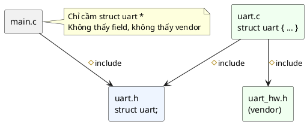

# 02 — Opaque Pattern

📖 Bài giảng chi tiết: [LECTURE.md](LECTURE.md). File này là ghi chú tóm tắt, bám theo chương *Opaque Pattern* của sách.

## Overview

Opaque = **Object Pattern + định nghĩa struct nằm trong file `.c`**. Header chỉ có `struct uart;` (incomplete type), nên bên ngoài chỉ cầm được con trỏ. Compiler cấm đọc field, cấm khai báo object, cấm `sizeof`.

## Use Cases

- **Cô lập dependency:** struct chứa kiểu của header vendor/HAL, không muốn header đó lọt ra mọi file.
- **Ngăn truy cập dữ liệu trực tiếp:** field private thật sự, compiler ép buộc.

## Benefits

- Giấu implementation: code dùng object không phải include các dependency của module.
- Giới hạn dependency: thư viện mà module phụ thuộc không "rò" ra ngoài, kể cả qua header.
- Sửa struct chỉ build lại một file `.c`.

## Drawbacks

- **Cần cơ chế cấp phát** (nhược điểm chính): `alloca`, `malloc`, hoặc pool tĩnh / sinh code.
- **Phá cây dữ liệu:** không lồng object vào struct cha được nữa, struct cha chỉ giữ con trỏ.
- Mất khả năng đọc field trong test; getter là lời gọi hàm thật.

## Implementation

Xem [inc/uart.h](inc/uart.h), [src/uart.c](src/uart.c), [src/uart_hw.h](src/uart_hw.h), [main.c](main.c).

| Cách cấp phát | API | Ghi chú |
|---|---|---|
| Stack | `alloca(uart_size())` | Nhẹ nhất, tự giải phóng; không thuộc chuẩn C |
| Heap | `uart_new()` / `uart_free(&p)` | Chỉ cấp phát lúc khởi động; luôn kiểm tra `NULL` |
| Tĩnh | `uart_pool_get()` / `uart_pool_put(&p)` | Biết RAM lúc build; hợp nhất cho firmware |

## Best Practices

- Dùng stack bất cứ khi nào có thể.
- Dùng cặp `new`/`free` để lộ rõ ý định cấp phát heap; luôn kiểm tra cấp phát thất bại.
- Hàm giải phóng nhận `**self` và đặt con trỏ của caller về `NULL`.
- `new` chỉ cấp phát, luôn gọi `init` ngay sau.

## Common Pitfalls

- Object lớn trên stack → tràn stack.
- `malloc`/`free` liên tục → phân mảnh heap.
- Trả con trỏ `alloca` ra khỏi hàm (gcc chỉ cảnh báo khi bật `-O2`).
- Trộn cách cấp phát, nhiều bản copy con trỏ, getter cho mọi field.

## Alternatives

- **Object** (bài 1): đơn giản hơn, nếu chấp nhận lộ dependency.
- **Singleton** (bài 3): không truyền cả con trỏ context; chỉ cho subsystem toàn cục.
- **Virtual API** (bài 7): interface trừu tượng tự nó đã opaque, nặng hơn.

## Quiz

1. Vì sao ta muốn giấu cấu trúc dữ liệu của object khỏi code bên ngoài implementation?
2. Vì sao Opaque Pattern cần một cơ chế cấp phát riêng?
3. Opaque Pattern ảnh hưởng thế nào tới cấu trúc dữ liệu của ứng dụng?
4. Vì sao nên tự động hóa việc cấp phát object lúc compile?

(Đáp án và 4 câu thêm trong [LECTURE.md](LECTURE.md#14-quiz-có-đáp-án).)

## Câu hỏi còn thắc mắc

-
